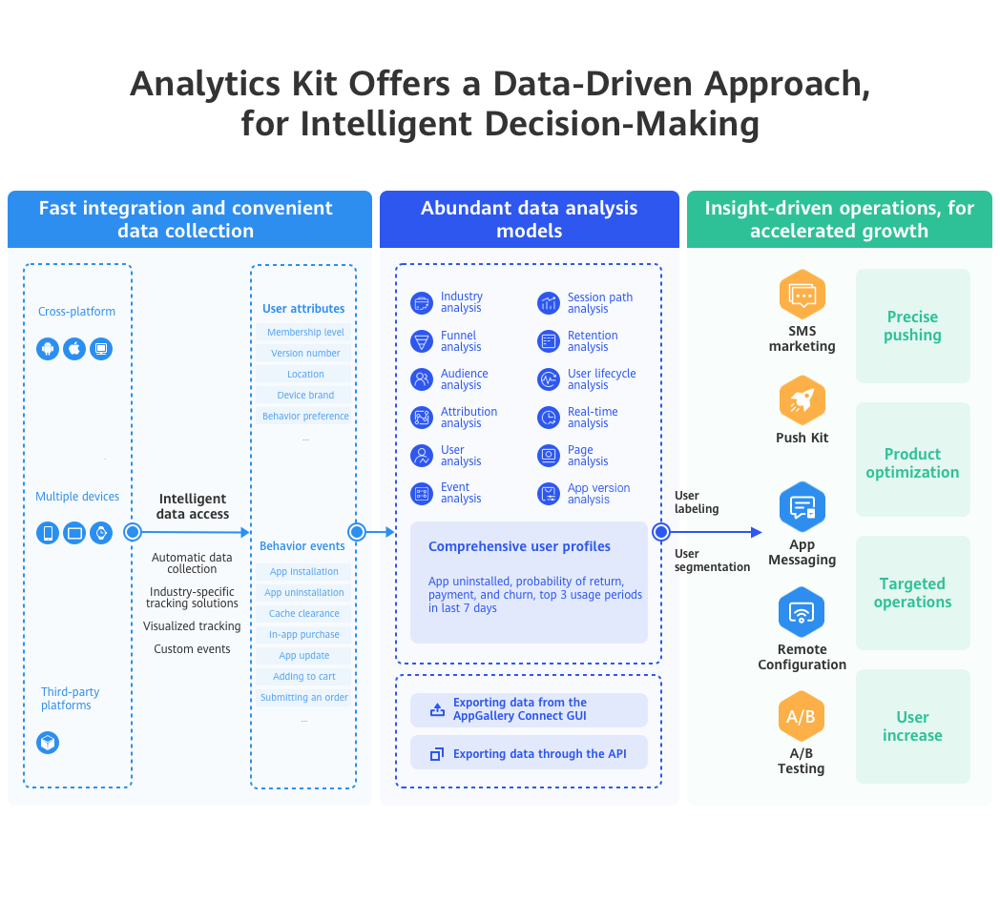
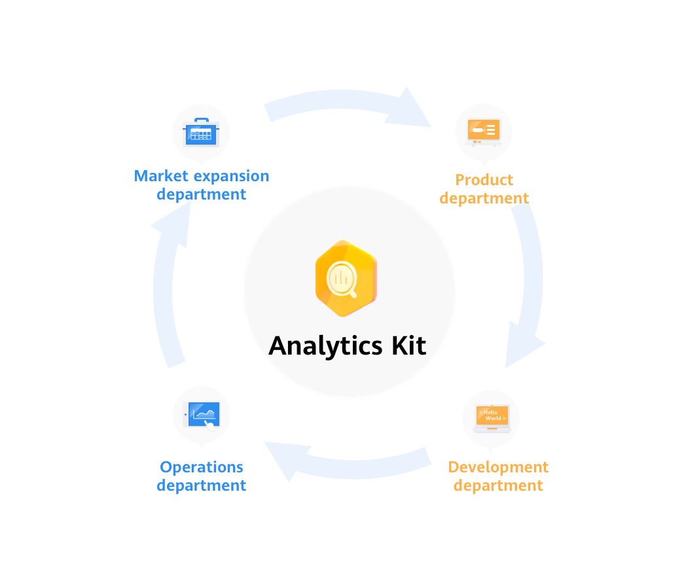
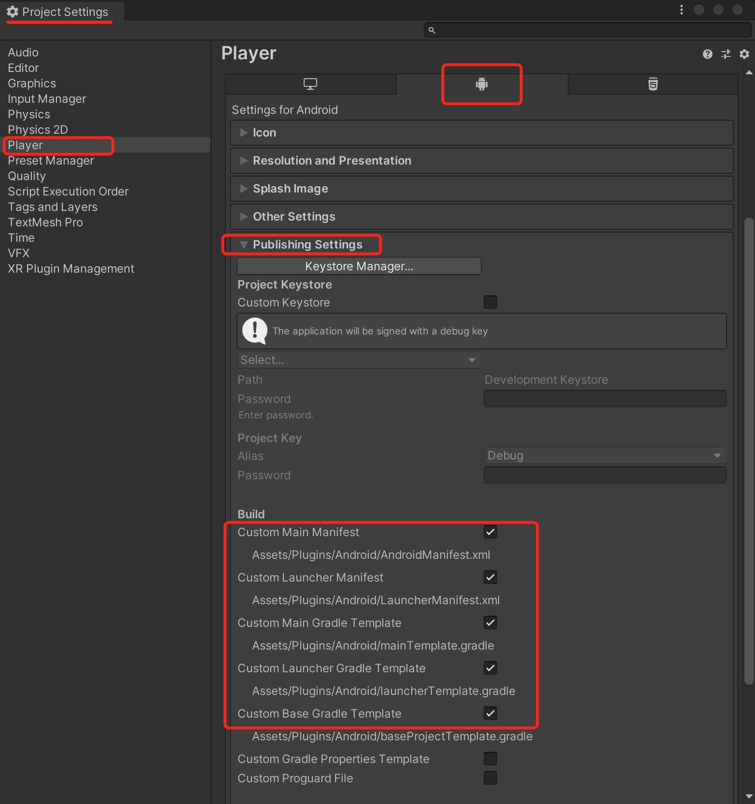
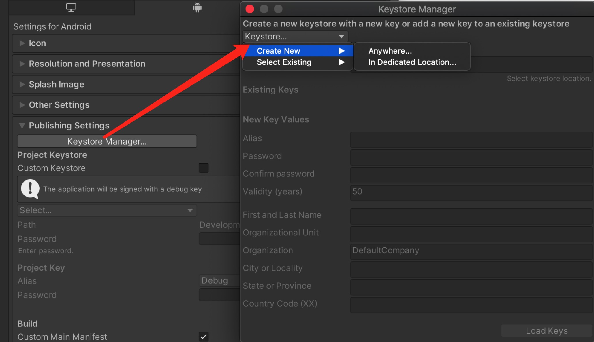

# Analytics Kit (HMS)

## Service Introduction

Analytics Kit is a one-stop user behavior analysis platform for products such as mobile apps, web apps, and mini-programs. It offers scenario-specific data collection, management, and analysis, helping enterprises achieve effective user acquisition, product optimization, precise operations, and business growth.



**It is a one-stop digital, intelligent data analysis platform tailored to meet the needs of enterprises' cross-departmental and cross-role personnel.**

Based on the user events, user attributes, and user behavior data automatically collected by the Analytics SDK, Analytics Kit can automatically generate data dashboards and analysis reports on user retention, users, user behavior, user lifecycle, versions, and crashes. In addition, it supports multi-dimensional drill-down analysis and comparison, satisfying data analysis requirements of different roles, such as the marketing personnel, product managers, activity operations personnel, user experience management personnel, and technical developers, as well as driving intelligent business analysis and decision-making.



## Integrating into Your Unity Project

### Register and get verified

Before doing this step, you need to create an HMS Account, project and App according to [the HMS document](https://developer.huawei.com/consumer/en/doc/development/HMS-Guides/Preparations).


Now you have your Huawei HMS Project and App information.

### Create an app

Create Unity project, and you will also need to set up the build environment for building Android apk with HMS SDK. Then, finish the following preparation.


In **Editor -> Build Settings**, Switch platform to Andriod and Connect your Android device


In **Player Settings -> Publishing Settings**, enable the following environment checkboxes



### Prepare for development

According to [HMS integration process introduction](https://developer.huawei.com/consumer/en/codelab/HMSPreparation/index.html#6), we still need to add some configurations to the gradle files for development preparations.


You can follow [Huawei documentation guidance](https://developer.huawei.com/consumer/en/codelab/HMSPreparation/index.html#6) to do the configuration, you can also refer and compare with the files in our [Unity example project](https://github.com/Unity-Technologies/HMSSDKSample/tree/master/Assets/Plugins/Android).

1. Enable and add configurations to `AndroidManifest.xml`

   Go to **Edit -> Project Settings -> Player -> Android(icon) -> Publishing Settings -> Build**

   Enable **Custom Main Manifest**

   If Unity Version is **2019.2 or before**, there is no **AndroidManifest** checkbox, but you can put `AndroidManifest.xml` under `Assets/Plugins/Android`.

   ```
    <?xml version="1.0" encoding="utf-8"?>
       <!-- GENERATED BY UNITY. REMOVE THIS COMMENT TO PREVENT OVERWRITING WHEN EXPORTING AGAIN-->
       <manifest
           xmlns:android="http://schemas.android.com/apk/res/android"
           package="com.unity3d.player"
           xmlns:tools="http://schemas.android.com/tools">
           <uses-permission android:name="android.permission.ACCESS_COARSE_LOCATION"/>
           <uses-permission android:name="android.permission.ACCESS_FINE_LOCATION"/>
           <uses-permission android:name="android.permission.ACCESS_BACKGROUND_LOCATION" />
           <uses-permission android:name="com.huawei.hms.permission.ACTIVITY_RECOGNITION" />
           <uses-permission android:name="android.permission.ACTIVITY_RECOGNITION" />
           <uses-permission android:name="android.permission.ACCESS_MOCK_LOCATION" />
           <application>
               <activity android:name="com.hms.hms_analytic_activity.HmsAnalyticActivity"
                       android:theme="@style/UnityThemeSelector">
                   <intent-filter>
                       <action android:name="android.intent.action.MAIN" />
                       <category android:name="android.intent.category.LAUNCHER" />
                   </intent-filter>
                   <meta-data android:name="unityplayer.UnityActivity" android:value="true" />
               </activity>
               <service
                   android:name="com.unity.hms.push.MyPushService"
                   android:exported="false">
                   <intent-filter>
                       <action android:name="com.huawei.push.action.MESSAGING_EVENT"/>
                   </intent-filter>
               </service>
               <receiver
                       android:name="com.unity.hms.location.LocationBroadcastReceiver"
                       android:exported="true">
                   <intent-filter>
                       <action android:name="com.huawei.hmssample.location.LocationBroadcastReceiver.ACTION_PROCESS_LOCATION" />
                   </intent-filter>
               </receiver>
               <receiver
                       android:name="com.unity.hms.location.GeoFenceBroadcastReceiver"
                       android:exported="true">
                   <intent-filter>
                       <action android:name="com.huawei.hmssample.geofence.GeoFenceBroadcastReceiver.ACTION_PROCESS_LOCATION" />
                   </intent-filter>
               </receiver>
           </application>
       </manifest>
   ```
   
2. Enable and add configurations to project gradle

   Go to **Edit -> Project Settings -> Player -> Android(icon) -> Publishing Settings -> Build**

   Enable **Custom Base Gradle Template** and add the AppGallery Connect plugin and the Maven repository. The path is `Assets/Plugins/Android/baseProjectTemplate.gradle`.

   If your unity version is **2019.2 or before**, you should add implement and other configuration on `MainGradleTemplate.gradle`.

   ```
       // GENERATED BY UNITY. REMOVE THIS COMMENT TO PREVENT OVERWRITING WHEN EXPORTING AGAIN
   
       allprojects {
           buildscript {
               repositories {**ARTIFACTORYREPOSITORY**
                   google()
                   jcenter()
                   maven { url 'https://developer.huawei.com/repo/' }
               }
   
               dependencies {
                   // If you are changing the Android Gradle Plugin version, make sure it is compatible with the Gradle version preinstalled with Unity
                   // See which Gradle version is preinstalled with Unity here https://docs.unity3d.com/Manual/android-gradle-overview.html
                   // See official Gradle and Android Gradle Plugin compatibility table here https://developer.android.com/studio/releases/gradle-plugin#updating-gradle
                   // To specify a custom Gradle version in Unity, go do "Preferences > External Tools", uncheck "Gradle Installed with Unity (recommended)" and specify a path to a custom Gradle version
                   classpath 'com.android.tools.build:gradle:3.4.0'
                   classpath 'com.huawei.agconnect:agcp:1.2.1.301'
                   **BUILD_SCRIPT_DEPS**
               }
           }
   
           repositories {**ARTIFACTORYREPOSITORY**
               google()
               jcenter()
               flatDir {
                   dirs "${project(':unityLibrary').projectDir}/libs"
               }
               maven { url 'https://developer.huawei.com/repo/' }
           }
       }
   
       task clean(type: Delete) {
           delete rootProject.buildDir
       }
   ```

3. Enable and add configurations to app gradle

   Go to **Edit -> Project Settings -> Player -> Android(icon) -> Publishing Settings -> Build**

   Enable **Custom Launcher Gradle Template** and add build dependencies in `launcherTemplate.gradle`. The path is `Assets/Plugins/Android/launcherTmeplate.gradle`.

   If unity version is **2019.2 or before**, you should add implement and other configuration on `MainGradleTemplate`.

   ```
       dependencies {
           implementation project(':unityLibrary')
           implementation 'com.android.support:appcompat-v7:28.0.0'
           implementation 'com.huawei.hms:hianalytics:5.1.0.300'
           implementation 'com.huawei.agconnect:agconnect-core:1.2.0.300'
           implementation 'com.huawei.hms:base:4.0.1.300'
           implementation 'com.huawei.hms:hwid:4.0.1.300'
           }
   ```
   
4. Enable and add configurations to unity library gradle

   Go to **Edit -> Project Settings -> Player -> Android(icon) -> Publishing Settings -> Build**

   Enable **Custom Main Gradle Template** and add build dependencies. The path is `Assets/Plugins/Android/mainTemplate.gradle`.

   If unity version is **2019.2 or before**, you should add implement and other configuration on `MainGradleTemplate.gradle`.

   ```
   dependencies {
       implementation fileTree(dir: 'libs', include: ['*.jar'])
       implementation 'com.huawei.hms:hianalytics:5.0.0.301'
       implementation 'com.huawei.agconnect:agconnect-core:1.2.0.300'
       implementation 'com.huawei.hms:base:4.0.1.300'
       implementation 'com.huawei.hms:hwid:4.0.1.300'
       implementation 'com.huawei.hms:game:4.0.1.300'
   **DEPS**}
   ```

5. Signature

   Go to **Edit -> Project Settings -> Player -> Android(icon) -> Publishing Settings -> Keystore Manager**

   Click **Keytore... -> create new**

   

   You need to enter the password when you open unity, otherwise you cannot build. There's no need to add a signature on gradle.

6. Signing Certificate Fingerprint

   Please refer to Huawei [preparation documentation step 4](https://developer.huawei.com/consumer/en/codelab/HMSPreparation/index.html#3) for generating a SHA256 Certificate Fingerprint.

   

   And refer to Huawei [preparation documentation step 5](https://developer.huawei.com/consumer/en/codelab/HMSPreparation/index.html#4) to add Fingerprint to AppGallery Connect.

   

7. Package name

   Set the package name in **Edit -> Project Settings -> Player**

   The package name is `com.${Company Name}.${Product Name}`.

   You can also complete the rest of the settings here, such as version number, icons, resolution, etc. 

   

8. `agconnect-services.json`

   We should put the json file under `Assets/Plugins/Android`.

   Add this following message into the json file downloaded from your Huawei developer dashboard. Also, you can [refer to that file](https://github.com/Unity-Technologies/HMSSDKSample/blob/master/Assets/Plugins/Android/agconnect-services.json) in our Unity example project.

   ```
   "agcgw":{
   "backurl":"connect-drcn.dbankcloud.cn",
   "url":"connect-drcn.hispace.hicloud.com"
   },
   ```

   You can refer to [this link](https://developer.huawei.com/consumer/en/doc/development/HMSCore-Guides/android-config-agc-0000001050170137) to create `agconnect-services.json`.

   

9. Get activity

   For getting the activity, you can use the  `Common.GetActivity()` function.

## Developing with the SDK
### Developing

There are corresponding example scenes in the [example project](https://github.com/Unity-Technologies/HMSSDKSample) for all 4 Kits. For testing, you will need to build it onto Android mobile build by HMS. Make sure you have already created your HMS account and project. Then, you can change the configuration and test different functions.


In the example project, the corresponding scene for Analytics Kit is  `Assets/HuaweiServiceDemo/Scenes/HmsAnalyticSampleScene.unity` and the code is `Assets/HuaweiServiceDemo/Scripts/test/AnalyticTest.cs`.

Analytic initialization must be done in `onCreate` of the first activity .
You can extend the **UnityPlayerActivity** file, and put java file in `Plugins/Android`.

```
public class HmsAnalyticActivity extends UnityPlayerActivity{
    @Override
    protected void onCreate(Bundle savedInstanceState) {
        super.onCreate(savedInstanceState);
        HiAnalyticsTools.enableLog();//analytic initialize
        HiAnalytics.getInstance(this);
    }
}
```
Then you need to set activity of `AndroidManifest.xml`.
```
 <application>
    <activity android:name="com.hms.hms_analytic_activity.HmsAnalyticActivity"
              android:theme="@style/UnityThemeSelector">
        <intent-filter>
            <action android:name="android.intent.action.MAIN" />
            <category android:name="android.intent.category.LAUNCHER" />
        </intent-filter>
        <meta-data android:name="unityplayer.UnityActivity" android:value="true" />
    </activity>
    ...
</application>
```
If you initialize analytic, you need to add analytic implentment to `mainTemplate.gradle`.


### Test & Release

Please refer to Huawei [integration procedure](https://developer.huawei.com/consumer/en/doc/start/htiHMSCore) for testing and releasing.


