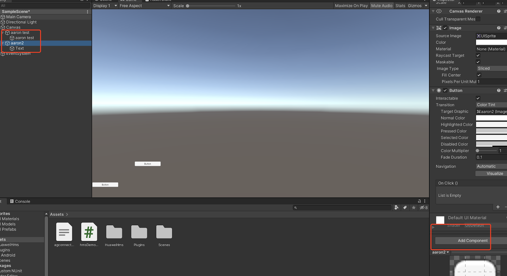
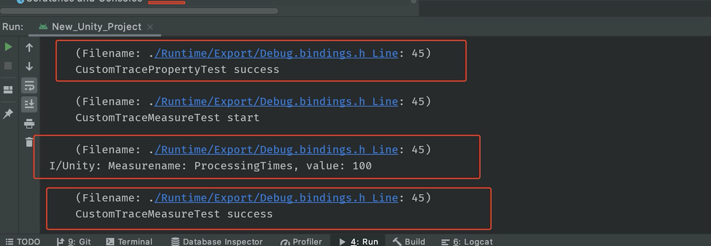

# APM (AGC)

## Service Introduction
[App Performance Management (APM)](https://developer.huawei.com/consumer/en/doc/development/AppGallery-connect-Guides/agc-apms-introduction) of HUAWEI AppGallery Connect provides minute-level app performance monitoring capabilities. You can view and analyze app performance data collected by APM in AppGallery Connect to comprehensively understand online performance of apps in real time, helping you quickly and accurately rectify app performance problems and continuously improve user experience.

### Functions

| <div style="width:140px">Function</div>                      | Description                                                  |
| :----------------------------------------------------------- | :----------------------------------------------------------- |
| Automatically collects performance data about app launches, app screen rendering, and HTTP/HTTPS network requests. | The APM SDK automatically collects key performance data about app launches, app screen rendering, and HTTP/HTTPS network requests.<br>1. App launch: app launch time in cold and warm launch modes.<br>2. App screen rendering: number of slow frames and frozen frames during app screen rendering.<br>3. HTTP/HTTPS network request: indicators such as the response duration, success rate, and response size. |
| Allows you to view and analyze app performance data to accurately identify the aspects that can be improved. | APM displays app performance indicators from multiple dimensions (such as the version number, country/region, device model, level-1 region, system version, carrier, and network), helping you quickly understand the aspects that can be improved. |
| Allows you to create custom traces to monitor app performance data in specific scenarios. | With the APM SDK, you can:<br>1. Create custom traces to monitor your app's performance in scenarios such as sign-in and scene loading.<br>2. Add indicators (such as the number of sign-in times) and properties (such as whether the sign-in is successful) for a custom trace. |

## Setting up in Unity

### Step 1: Integrating the AppGallery Connect SDK

Before integrating the APM SDK, ensure that your app has integrated the AppGallery Connect SDK and AppGallery Connect plug-in. For details, please refer to [Getting Started with Android.](https://developer.huawei.com/consumer/en/doc/development/AppGallery-connect-Guides/agc-get-started)

**Note**:

1. Copy the  `agconnect-services.json` file to `Assets/Plugins/Android/`

2. Open the  `launcherTemplate.gradle` in `Assets/Plugins/Android/`

   Add the following information under `apply plugin: 'com.android.application'` in the file header:

   ```
   apply plugin: 'com.android.application’
   apply plugin: 'com.huawei.agconnect'
   ```

   Configure build dependencies.

   ```
   dependencies {      
    implementation 'com.huawei.agconnect:agconnect-core:1.5.2.300'    
   }

   ```
3. Open the `baseProjectTemplate.gradle` in `Assets/Plugins/Android/`

   Add the following configurations:

   ```
   allprojects {  
              repositories {  
                  google()  
                  jcenter()  
                  maven {url 'https://developer.huawei.com/repo/'}  
              }  
          }

   buildscript {  
              repositories {  
                  google()  
                  jcenter()  
                  maven {url 'https://developer.huawei.com/repo/'}  
              }  
   }

   buildscript {  
              dependencies {  
               classpath 'com.huawei.agconnect:agcp:1.5.2.300'
              }  
   }
   ```

### Step 2: Integrating the APM SDK
After being integrated into your app, the APM SDK automatically collects app performance data such as [app launch performance data]((https://developer.huawei.com/consumer/en/doc/development/AppGallery-connect-Guides/agc-apms-appstart)) and [app screen rendering performance data.](https://developer.huawei.com/consumer/en/doc/development/AppGallery-connect-Guides/agc-apms-appscreen)

Add the APM SDK dependency to `launcherTemplate.gradle` in `/Assets/Plugins/Android/`
 file (usually in the app directory).

```
dependencies {
// ...
// Add APM SDK library dependency
    implementation 'com.huawei.agconnect:agconnect-apms:1.5.2.305'
}
```

* Add the following items to the proguard file in your Unity project for obfuscation configurations([Reference](https://developer.huawei.com/consumer/en/doc/development/AppGallery-connect-Guides/agc-apm-android-getstarted-0000001052887262)):
```
-keep class com.huawei.agconnect.**{*;}
-dontwarn com.huawei.agconnect.**
-keep class com.hianalytics.android.**{*;}
-keep class com.huawei.updatesdk.**{*;}
-keep class com.huawei.hms.**{*;}
-keep interface com.huawei.hms.analytics.type.HAEventType{*;}
-keep interface com.huawei.hms.analytics.type.HAParamType{*;}
-keepattributes Exceptions, Signature, InnerClasses, LineNumberTable
```

### Step 3: Integrating the APM Plug-in
The APM plug-in uses the instrumentation technology to collect [HTTP/HTTPS network request performance data](https://developer.huawei.com/consumer/en/doc/development/AppGallery-connect-Guides/agc-apms-appnetwork) without intrusion. To add the APM plug-in to your app, perform the following steps:
1. Add the APM plug-in to the `launcherTemplate.gradle` file

   ```
   apply plugin: 'com.android.application'
   // Apply the AGC plugin
   apply plugin: 'com.huawei.agconnect'
   agcp {
      enableAPMS true
   }

   dependencies {
    // ..
   }
   ```

2. Add the APM plug-in to the baseProjectTemplate.gradle file.

    ```
    buildscript {
     repositories {
       // Add the maven repository
       maven { url 'https://developer.huawei.com/repo/' }
     }
     dependencies {
       // ...
       // To benefit from the latest APM feaures, update your Android Gradle Plugin dependency to at least v3.3.2
       classpath 'com.android.tools.build:gradle:3.3.2'
       // Add the dependency for the APM plugin
       classpath 'com.huawei.agconnect:agconnect-apms-plugin:1.5.2.300'
     }
    }
    ```

### Step 4: Integrating the APM Game SDK (Optional)
Add the APM SDK dependency to `launcherTemplate.gradle` in `/Assets/Plugins/Android/`
 file (usually in the app directory).

```
dependencies {
// ...
// Add APM SDK library dependency
   implementation 'com.huawei.agconnect:agconnect-apms:1.5.2.305'
   implementation 'com.huawei.agconnect:agconnect-apms-game:1.5.2.303'
}
```

## Developing with the SDK

### Viewing Performance Monitoring Data

See [Viewing Performance Monitoring Data.](https://developer.huawei.com/consumer/en/doc/development/AppGallery-connect-Guides/agc-apms-viewdata)


### Optional: Using APM
1. [Creating a Custom Trace. ](https://developer.huawei.com/consumer/en/doc/development/AppGallery-connect-Guides/agc-apms-addtrace)
2. [Using Annotation @AddCustomTrace](https://developer.huawei.com/consumer/en/doc/development/AppGallery-connect-Guides/agc-apms-addcustomtrace)

（note：At present, this function can only be applied to the main assembly, if the user code is in a custom assembly, it cannot be parsed)

3. [Adding Indicators to Monitor Specific Network Requests](https://developer.huawei.com/consumer/en/doc/development/AppGallery-connect-Guides/agc-apms-addnetworkmeasure)
4. [Viewing Debug Logs](https://developer.huawei.com/consumer/en/doc/development/AppGallery-connect-Guides/agc-apms-viewlog)
5. [Configuring the AndroidManifest.xml File](https://developer.huawei.com/consumer/en/doc/development/AppGallery-connect-Guides/agc-apms-configuremanifest)

### Optional: Using APM Game SDK
In the initialization method at the beginning of the game, call the startGamePlugin() method of APMS to enable the SDK
```
void Start()
{
    // In order to start APMS Game Plugin, you need to call this method
    GameAPM.getInstance().start();

    // Your own business code
    // ...
}
```
```
void OnDestroy() {
    // In order to start APMS Game Plugin, you need to call this method
    GameAPM.getInstance().stop();
    // Your own business code
    // ...
}
```

In order to quickly find out whether the scene loading time exceeds the normal range, you can call APMS startLoadingScene (GameAttribue gameAttribute) and stopLoadingScene (String scene) to record the scene loading time.
```
public void scenceLoadToGame()
{
	// start record the loading scene time
	String scene = GameAPM.getInstance().startLoadingScene(new GameAttribute("Game", LoadingState.NOT_LOADING));
	SceneManager.LoadScene("Game");

	// Other code
	// ...

	// stop record the loading scene time
	GameAPM.getInstance().stopLoadingScene(scene);
}
```

You can view detailed game performance data on the "Application Performance Management" page, including scene analysis data, frame time data, and scene loading data.

Prerequisites：
1. Your application has enabled the APM service.
2. Your application has integrated the APM Game SDK and runs on the device.

View game scene analysis：
1. Log in to the AppGallery Connect website and click on ‘My Projects’.
2. Find your project in the project list, and select the application you want to view in the application list under the project.
3. Choose ‘Quality -> Performance’ Management to enter the ‘Application Performance Management’ page.
4. Click ‘Experience Analysis -> Game Scene Analysis’ to enter the game scene analysis page.

For more details, please refer to the appendix of this document.

### Setting up a scene
1. Open a scene:

   

2. Right click and select UI and then you can choose a button:

   

3. Add component to the button and develop a script:

   

   

4. Edit the script:

   

   Double click the script file,and u will open it in VS code

   

5. (Optional) Using API

   ```
   void Start()
   {

   }

   // Update is called once per frame
   void Update()
   {

   }
    public void CustomTraceMeasureTest(CustomTrace customTrace) {
              UnityEngine.Debug.Log("CustomTraceMeasureTest start");

              customTrace.putMeasure("ProcessingTimes", 0);
              for (int i = 0; i < 100; i++) {
                  customTrace.incrementMeasure("ProcessingTimes", 1);
              }

              long value = customTrace.getMeasure("ProcessingTimes");
              Debug.Log("Measurename: ProcessingTimes, value: "+ value);

              UnityEngine.Debug.Log("CustomTraceMeasureTest success");
          }
   ```

   Create a function above

6. Bind buttons and interfaces in scripts

   

   - Step1. Click “+” to add a function.

   - Step2. Choose the corresponding scene which has the interface you want to use.

   - Step3. Click “No Function” select to choose the script and then choose the corresponding function.

        

### Demo Project

How to use the demo project?

- Step 1: Create a repo from:  https://github.com/Unity-Technologies/unity-hms_sdk/tree/apm and checkout to “apm” branch.

- Step 2: Replace  `agconnect-services.json` file from your remote project and configure your gradle files, refer to Part 2. Step 1 to Step 3.

- Step 3: Open Unity Hub, add HuaweiServiceDemo Project (Unity version 2019.3).

- Step 4: switch platform to Android and Open Performance Test Scene: `Assets/HuaweiHmsDemo/HmsPerformanceSampleTest`

  If there has some compile error like this:

   > Microsoft (R) Visual C# Compiler version 2.9.1.65535 (9d34608e)
   > Copyright (C) Microsoft Corporation. All rights reserved.
   >
   > error CS0009: Metadata file      '/Users/yanmeng/Desktop/unity_agc_new/unity-hms_sdk/hmsDemo/Library/ScriptAssemblies/Unity.Timeline.Editor.dll' could not be opened -- Image is too small.
   > Assets/HuaweiHms/src/hms/Wrapper/fundation/HmsClass.cs(72,25): warning CS0693: Type parameter 'T' has the same name as the type parameter from outer type 'HmsClass<T>'

   Try to reopen this project which always solve this problem.

- Step 5: Set Android build keystore in **Build Settings -> Android -> PlayerSettings-> Publish Settings**. As shown below. And the password of hhmm is 123456.

   

- Step 6: build android apk and run on Android device. Use logcat to check whether test cases are executed successfully.

   

### appendix
#### APM Game Plugin data security instructions

How Plugin works

- APM Game Plugin is packaged with the application, starts working when the user starts the application, and automatically collects application performance data. When the user closes the application, Plugin will stop collecting application performance data.

Permission Description

- none

Data Collection

1. Basic data attributes

    - Application basic properties: application name, application version name, application version number, application package name (application ID).

    - Basic device attributes: device manufacturer, device architecture, device model, screen size, resolution, screen type (super large, large, medium, small, unknown), screen refresh frequency, CPU model, number of CPU cores, memory size, disk size, User CPU time, system CPU time, maximum heap memory, used heap memory.

    - Basic platform attributes: operating system name, operating system version, ROM name, ROM version, APM SDK version, AAID, AGC cpID, AGC productID, AGC ClientID, AGC AppID.

    - Basic properties at runtime: charging status, battery level, network type, screen orientation, application front and back status, APM SDK session ID, available disk space, application memory usage.

    - User settings attributes: default time zone settings, default language settings, DNS settings.

    - Custom tracking record attributes: custom attributes set by the developer.

2. Index data

    - Frame rate data: scene name, loading status, frame rate number.

    - Loading data: scene name, loading status, loading duration.

3. Data Security Protection

    - APM Game Plugin encrypts the collected data locally, and the encrypted data is transmitted to the APM server through the HTTPS security protocol.

    - Huawei strictly follows the "General Data Protection Regulations" (GDPR), and Huawei is also committed to helping developers succeed under the premise of complying with GDPR regulations. GDPR stipulates the obligations of data controllers and data processors. When using the service, developers play the role of "data controller" and Huawei is the "data processor". The data is under the control of the developer. Huawei only processes the data within the scope of the obligations and rights of the "data processor", and the developer is responsible for complying with the GDPR and assumes the obligations of the "data controller".
