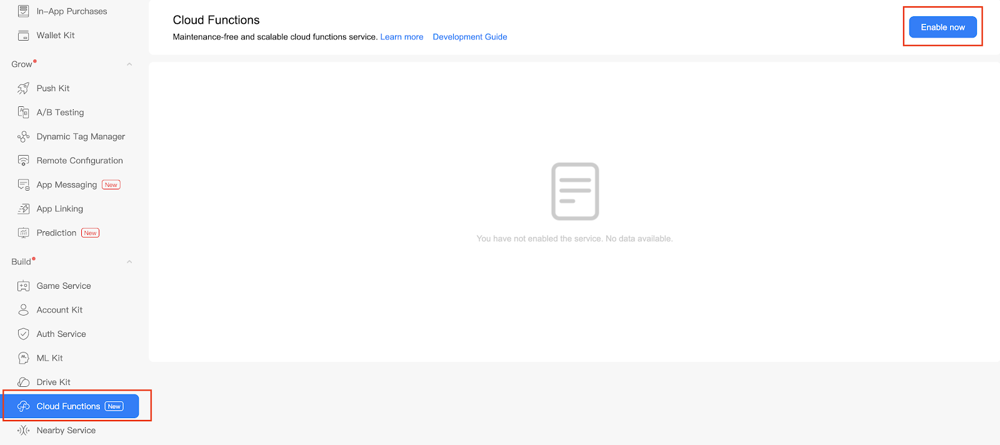
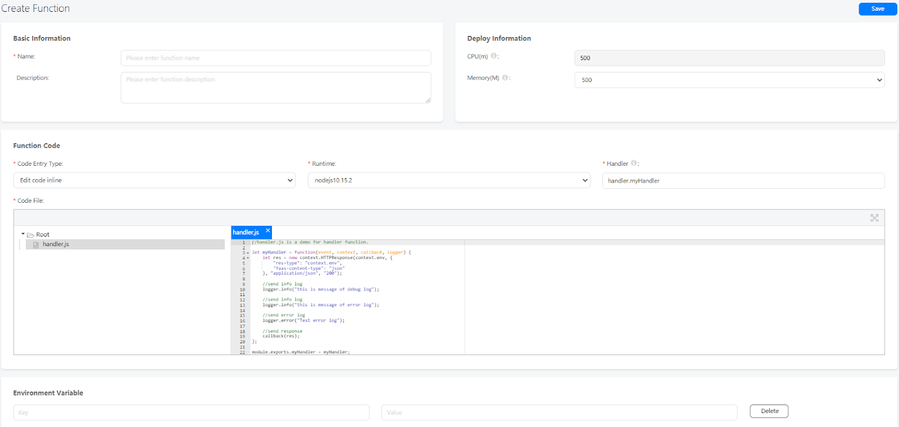
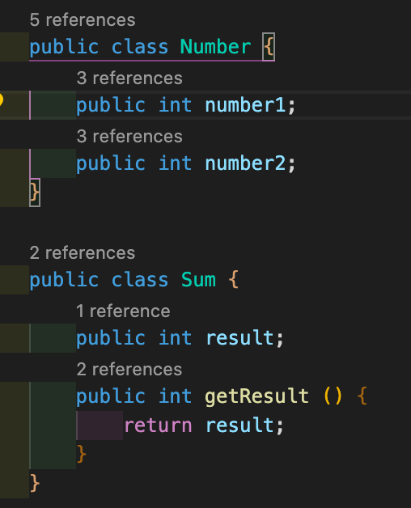
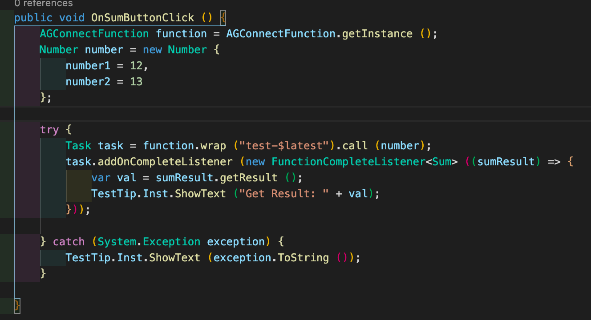
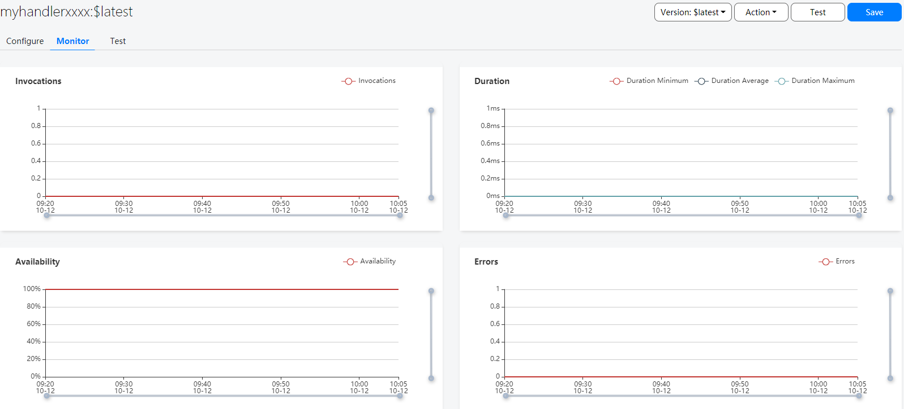

# Cloud Functions (AGC)
## Introduction 
[Cloud Functions](https://developer.huawei.com/consumer/en/doc/development/AppGallery-connect-Guides/agc-cloudfunction-introduction) enables serverless computing. It provides the Function as a Service (FaaS) capabilities to simplify app development and O&M so your functions can be implemented more easily and your service capabilities can be built more quickly.

### Main Functions
- Cloud Functions provides an efficient and reliable framework for developing and running functions. It frees you from complex traditional development and O&M of apps. Server configuration and management, code deployment, load balancing, autoscaling, and high reliability assurance are now streamlined. You only need to focus on service logic and function code to build reliable and scalable serverless apps.
- As the core of serverless computing, Cloud Functions works with other cloud services like building blocks to implement your service logic.

### Concepts
With Cloud Functions, you can develop functions using programming languages supported by AppGallery Connect and run them in a serverless environment. Each function instance receives and responds to events in an isolated environment. Cloud Functions guarantees reliable function instances and scales their number as needed.
- Function: A script or program running in Cloud Functions to respond to events.
- Event source: Other services (such as Cloud DB) in AppGallery Connect, or your custom services. An event source can release multiple types of events to trigger functions.
- Trigger: Configured to listen on a specified type of event from the event source. Triggers vary by event source, event type, and function-event mapping, and submit data of the specified type of event to a function for handling.
- Alias: A pointer to a specific function. You can create one or more aliases for a function. The function caller (including the trigger) can access a function through its alias.

### Use Cases
Cloud Functions lets you run function code to respond to specific events, such as:
- Sending event notifications to users.
- Executing database cleaning and maintenance tasks.
- Executing intensive tasks on the cloud.
- Integrating third-party services and APIs.

### Apply for Test Qualification
Cloud Functions is still in Beta state. To use Cloud Functions, send an application email to ``agconnect@huawei.com`` to apply for the service.
Set your email title format as: [Cloud Functions]-[Company name]-[Developer account ID]-[Project ID]. For details about how to query the developer account ID and project ID, please refer to [Querying the Developer Account ID and Project ID](https://developer.huawei.com/consumer/en/doc/development/AppGallery-connect-Guides/agc-query-ID). Huawei operation personnel will reply within 1 to 3 working days.

### Charge
Currently, Cloud Functions is in beta test and **free** of charge. Huawei will email you a notice about pricing policies one month in advance of formal charging.

## Setting up in Huawei AppGallery Connect

### Getting Started
The typical process for developing a function is as follows:

- Integrating the SDK: To call Cloud Functions in your app, you must integrate the client SDK of Cloud Functions into your app.
- Creating a function: You need to create a function in AppGallery Connect and add the function code.
- Testing the function: AppGallery Connect allows you to directly test the function code.
- Calling the function: You can configure to call the function as needed in a trigger or your app.
- Monitoring the function: AppGallery Connect allows you to view function monitoring information such as the call times and execution success rate.

### Integrating the Cloud Functions SDK
You must integrate the AppGallery Connect SDK and plug-in before integrating the Cloud Function SDK into your app. For details, please refer to [AppGallery Connect Quick Start](https://developer.huawei.com/consumer/en/doc/development/AppGallery-connect-Guides/agc-get-started).

### Creating a Function

1. Sign in to [AppGallery Connect](https://developer.huawei.com/consumer/en/service/josp/agc/index.html) and select **My projects**.

2. Find your project from the project list and click the app for which you want to use Cloud Functions on the project card.

   

3. Go to **Build > Cloud Functions**. The Cloud Functions page is displayed.

4. If Cloud Functions is not enabled, click **Enable now** to enable it.

   

   **Notice:**<br>You may need to set the data storage location when enabling Cloud Functions. Then, the setting in agconnect-services.json will be automatically updated accordingly. If you have set the data storage location when enabling APM, you need to download the agconnect-services.json file again and integrate it into your project after the service is enabled. For details, please refer to [Adding the Configuration File](https://developer.huawei.com/consumer/en/doc/development/AppGallery-connect-Guides/agc-get-started#addjson).

5. Config json file in Unity Application.

   On the Project Settings page, download the configuration file `agconnect-services.json`.
   
   Copy the `agconnect-services.json` file to the `Assets/Plugins/Android` folder in your Unity project. 

   

   

6. Click **New Function** on the Functions page.

   

7. Define the function on the page that is displayed.

   - Enter a name and description of the function in Name and Description, respectively.

   - Set Code Entry Type to Edit code inline or *.zip file. If Edit code online is selected, you can directly edit the function code in Code File. AppGallery Connect provides the default myHandler function code for your reference.
   
   - Enter the deployment information in Deployment Information. You can retain the default values.
   
   - Enter input variables for calling the function in Environment Variable.
   
   For details about the detailed function configuration, please refer to [Function Configuration](https://developer.huawei.com/consumer/en/doc/development/AppGallery-connect-Guides/agc-cloudfunction-config). For details about how to edit function code, please refer to [Programming Model](https://developer.huawei.com/consumer/en/doc/development/AppGallery-connect-Guides/agc-cloudfunction-programmode).
   
   
   The following sample code implements the single Sum function:
   
   ```
   //handler.js is a demo for handler function.
   
   let myHandler = function(event, context, callback, logger) {
       
       let res = new context.HTTPResponse(context.env, {
           "res-type": "context.env", 
           "faas-content-type": "json"
       }, "application/json", "200");
   
       var number; 
       if (event.body) { 
           var _body = JSON.parse(event.body); 
           number = _body.number; 
       } else {
           number = event.number; 
       }
       var sum = number.number2 + number.number1;
      
       res.body = {
           "result": sum
       };
       context.callback(res);
   };
   
   module.exports.myHandler = myHandler;
   ```

8. Click **Save**.

## Creating Unity CloudFunction Android Application

### Setting up Unity Custom Android manifest and gradle

1. Switch platform to Android in **Player setting**.

2. Enable custom manifest and gradle in Player setting. The following is in unity **2019.4**.

   

3. Set the package name in **Edit -> Project Settings -> Player ->  Android(icon) -> other settings -> Identification -> Package Name**.

    The package name is the package name of app in huawei project.
    
    

### Enable and add configurations to project gradle

Open **Edit -> Project Settings -> Player -> Android(icon) -> Publishing Settings -> Build**. 
Enable **Custom Base Gradle Template** and add the configuration to the Maven repository which path is  `Assets/Plugins/Android/baseProjectTemplate.gradle`.

The repository is:

```
    allprojects {
        buildscript {
            repositories {
...
                maven { url 'https://developer.huawei.com/repo/' }
            }
           dependencies {
                classpath 'com.android.tools.build:gradle:3.4.0'
                classpath 'com.huawei.agconnect:agcp:1.4.1.300'
           }
...
        }
...
        repositories {
...
            maven { url 'https://developer.huawei.com/repo/' }
...
        }
    }
```

### Enable and add configurations to app gradle
Open **Edit -> Project Settings -> Player -> Android(icon) -> Publishing Settings -> Build**. 

Enable **Custom Launcher Gradle Template** and add the configuration to the Maven repository which path is `Assets/Plugins/Android/launcherTmeplate.gradle`

```
apply plugin: 'com.huawei.agconnect'

dependencies {
...
   implementation project(':unityLibrary')
   implementation 'com.android.support:appcompat-v7:28.0.0'
...
   }
```

To add CloudFunction Kit:

```
  dependencies {
…
   implementation "com.huawei.agconnect:agconnect-function:1.4.2.300"
   implementation 'com.fasterxml.jackson.core:jackson-databind:2.8.5'
   implementation 'com.fasterxml.jackson.core:jackson-core:2.8.5'
   implementation 'com.fasterxml.jackson.core:jackson-annotations:2.8.5'
...
}
```

**In Early Version**

If unity version is **2019.2 or before**, you should add implement and other configuration on MainGradleTemplate. 

```
buildscript {
            repositories {
...
                maven { url 'https://developer.huawei.com/repo/' }
...
            }
        dependencies {
            classpath 'com.android.tools.build:gradle:3.4.0'
            classpath 'com.huawei.agconnect:agcp:1.4.1.300'
       }

...
        }
…
allprojects {
        repositories {
...
            maven { url 'https://developer.huawei.com/repo/' }
...
        }
    }
…
apply plugin: 'com.huawei.agconnect'

dependencies {
...
   implementation 'com.android.support:appcompat-v7:28.0.0'
   implementation 'com.android.support:appcompat-v7:28.0.0'
   implementation 'com.huawei.agconnect:agconnect-core:1.2.0.300'
   implementation "com.huawei.agconnect:agconnect-function:1.4.2.300"
   implementation 'com.fasterxml.jackson.core:jackson-databind:2.8.5'
   implementation 'com.fasterxml.jackson.core:jackson-core:2.8.5'
   implementation 'com.fasterxml.jackson.core:jackson-annotations:2.8.5'
...
   }
```

## Developing with the SDK

### Setting up Unity Scene

1. Open a scene:

    

2. Right click and select UI and then you can choose a button:

    

3. Add component to the button and develop a script:

    

    

4. Edit the script:

    

   Double click the script file,and u will open it in VS code

    

5. Using CloudFunction Interface

    Define model class which will be used as input and output parameters.

    

    Initialize AGConnectFunction instance, and invoke Wrap with http trigger which you have created above. Then, create a asynchronous task, and bind onCompleteListener to handle function result.

    

6. Bind buttons and interfaces in scripts

    

    - Step1. Click “+” to add a function

    - Step2. Choose a the corresponding scene which has the interface you want to use

    - Step3. Click the **No Function** select to choose the script and then choose the corresponding function, in this example is `OnSumButtonClick()`

     

### Testing the Function

You can test the created function in AppGallery Connect to check whether the function code can run normally.

1. On the function list page, click the name of the created function to go to the function details page.
   
2. After the test is complete, view the test result on the function test page.

For more information about the cloud function test, please refer to [Function Test](https://developer.huawei.com/consumer/en/doc/development/AppGallery-connect-Guides/agc-cloudfunction-test).

For example, you can test the Sum function above by those params:


### Calling the Function

After creating and testing a function, you can call it in either of the following ways:

- Calling the function in a trigger: Create a trigger in the function to call the function when the triggering condition is met. For details, please refer to [Function Call in a Trigger](https://developer.huawei.com/consumer/en/doc/development/AppGallery-connect-Guides/agc-cloudfunction-triggercall).

- Calling the function in your app: Call the function using APIs of the Cloud Functions SDK in your app. For details, please refer to [Function Call in an App](https://developer.huawei.com/consumer/en/doc/development/AppGallery-connect-Guides/agc-cloudfunction-appcall).
  
    **Notice:**
    To call a function in your app, you must create a trigger of the HTTP type in the function or function alias.
    
    You are advised to call a function using the release function version or name. For details, please refer to [Version Management](https://developer.huawei.com/consumer/en/doc/development/AppGallery-connect-Guides/agc-cloudfunction-version) and [Alias Management](https://developer.huawei.com/consumer/en/doc/development/AppGallery-connect-Guides/agc-cloudfunction-aliasname).

### Monitoring the Function

Click Dashboard under Cloud Functions to go to the function monitoring page. On this page, you can monitor related indicators of the function, including:

- Call times

- Execution delay, including the minimum delay, maximum delay, and average delay

- Execution success rate

- Failure times

  


