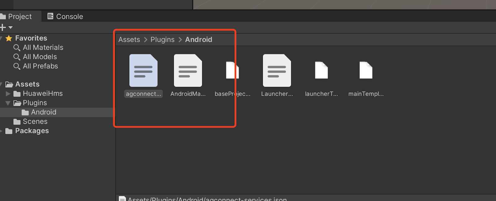

# 云数据库（AGC）


## 业务介绍


### 概述

传统的移动应用开发，开发者需要从头开始构建每一个服务，开发工作量大，门槛高。开发者在写应用逻辑之外，还需要解决数据管理、端云数据同步和服务器部署维护等难题。

Cloud DB是一款端云协同的数据库产品，提供端云数据的协同管理、统一的数据模型和丰富的数据管理API接口等能力。在保证数据的可用性、可靠性、一致性，以及安全等特性基础上，能够实现数据在客户端和云端之间的无缝同步，并为应用提供离线支持，以帮助开发者快速构建端云、多端协同的应用。同时，Cloud DB作为AppGallery Connect解决方案的一部分，为AppGallery Connect平台构建了MBaaS（Mobile Backend as a Service，移动后端即服务）能力。从而让应用开发者聚焦于应用本身的业务，极大的提升开发者的生产效率。


### 申请测试资格

云数据库功能当前仍处于Beta开放状态，在使用此功能前，您需要请先[下载](https://communityfile-drcn.op.hicloud.com/FileServer/getFile/cmtyManage/011/111/111/0000000000011111111.20201116172118.88537352977603019768403709254632:50511117121803:2800:12FAE04C002ADCC823CF3E58B7644DD4933C2E60BA1236FC0C747A65D1556947.xlsx?needInitFileName=true)表格并填写，然后作为附件发送至agconnect@huawei.com，申请云数据库功能。

邮件标题格式：“[云数据库]-_[公司名称]_-_[开发者帐号ID]_-_[应用ID]_”，开发者帐号ID及项目ID查询方法可参见[查询开发者帐号ID及项目ID](https://developer.huawei.com/consumer/cn/doc/development/AppGallery-connect-Guides/agc-query-ID)。

在收到您的申请后，华为运营人员会在1-3个工作日内给您答复。


### 如何收费

云数据库属于资源消耗型服务，未来会基于数据记录条数、存储空间和网络的占用情况来进行收费。目前云数据库功能处于Beta测试期间，您可以免费使用。我们会在正式收费前一个月邮件通知并公告相关策略及费率。

开通云数据库服务时，系统默认为您提供如下配额的免费云数据库服务。


<table>
  <tr>
   <td><strong>服务类别</strong>
   </td>
   <td><strong>配额</strong>
   </td>
  </tr>
  <tr>
   <td>云侧存储容量
   </td>
   <td>2GB
   </td>
  </tr>
  <tr>
   <td>最大并发连接数
   </td>
   <td>150
   </td>
  </tr>
  <tr>
   <td>云侧数据库每秒最大操作数
   </td>
   <td>10
   </td>
  </tr>
</table>

使用Cloud DB服务时，如果免费资源配额不能满足开发人员当前的应用程序需求 ，您可[下载申请表](https://communityfile-drcn.op.hicloud.com/FileServer/getFile/cmtyManage/011/111/111/0000000000011111111.20201030091810.06962989220424325009804976035185:50511103085702:2800:64FD098C479820A4BC92E57D8F71B71FB53A5816702A9C89A07D54FF5332B227.xlsx?needInitFileName=true)并填写内容，然后将其发送到电子邮件地址以提交申请。 电子邮件地址和电子邮件标题格式与[申请测试资格](https://docs.cocos.com/creator/manual/en/cocos-service/agc-clouddb.html#apply-for-test-qualification)一致。

## 华为账号设置

### 使用入门

#### 申请开通服务

云数据库功能当前仍处于Beta开放状态，在使用此功能前，您需要请先[下载](https://communityfile-drcn.op.hicloud.com/FileServer/getFile/cmtyManage/011/111/111/0000000000011111111.20201116172118.88537352977603019768403709254632:50511117121803:2800:12FAE04C002ADCC823CF3E58B7644DD4933C2E60BA1236FC0C747A65D1556947.xlsx?needInitFileName=true)表格并填写，然后作为附件发送至agconnect@huawei.com，申请云数据库功能。

邮件标题格式：“[云数据库]-_[公司名称]_-_[开发者帐号ID]_-_[项目ID]_”，开发者帐号ID及项目ID查询方法可参见[查询开发者帐号ID及项目ID](https://developer.huawei.com/consumer/cn/doc/development/AppGallery-connect-Guides/agc-query-ID)。

在收到您的申请后，华为运营人员会在1-3个工作日内给您答复。

**注意：**

本邮箱地址仅处理云数据库开通申请，其他咨询类问题请勿发送至本邮箱。

#### Cloud DB 概述

Cloud DB的数据同步模式包括缓存模式和本地模式，数据同步以存储区为粒度进行设置。在开发应用时，您可以根据应用需求为每个存储区选择不同的数据同步模式。应用可以仅使用缓存模式或者本地模式，也可以同时使用缓存模式和本地模式。缓存模式和本地模式的具体信息如下：

*   缓存模式 
在该模式下，您可实现数据的端云协同管理，实现端云、多端之间的数据同步。应用数据将会储存在云侧，端侧数据是云侧数据的子集，如果允许持久化，Cloud DB支持将查询的结果自动缓存至端侧。缓存数据时，不会覆盖本地未同步完成的数据。
*   本地模式 
在该模式下，用户仅可操作端侧所包含的本地数据，无法实现数据在端云、多端间的同步。

基于Cloud DB服务的应用开发流程如下图所示。


#### 权限管理

Cloud DB可以验证所有用户的访问权限，以确保应用程序数据的安全性。 默认情况下，从云访问Cloud DB的用户被分配为管理员角色，即从AppGallery Connect控制台或云功能访问Cloud DB的用户默认情况下具有所有权限。 该设备是应用程序运行的地方。 设备上的数据操作受到安全规则的严格限制。设备端数据的读写权限是基于云上的权限管理表来控制的。

Cloud DB支持以缓存模式和本地模式进行应用程序开发。 数据权限管理因模式而异。

- 在缓存模式下，在设备和云之间建立数据同步通道后，云上的权限管理表将同步到设备，以使设备控制数据权限。
- 在本地模式下，设备上的数据操作不受云上权限管理表的影响。 设备对设备端数据具有所有操作权限。

注意：

在以下几种缓存模式的场景下，设备侧用户的数据操作权限如下：

- 在安装应用程序之后和首次建立设备-云同步通道之前，设备侧用户没有任何权限。 设备应用从云中获取权限管理表后，会根据权限配置表分配设备侧用户权限。

- 如果设备端用户注销了AppGallery Connect身份验证或AppGallery Connect身份验证到期（例如，脱机持续时间超过了身份验证信息的有效期限），则该用户的角色将从Authenticated user 更改为Everyone，并且用户拥有Everyone角色的所有权限。

Cloud DB定义了四个角色：每个人，经过身份验证的用户，数据创建者和管理员，以及三个权限：查询，更新（包括添加和修改）和删除。

表1-1权限配置表

| Role               | Query | Upsert | Delete |
| ------------------ | ----- | ------ | ------ |
| Everyone           | √     | –      | –      |
| Authenticated user | √     | √      | √      |
| Data creator       | √     | √      | √      |
| Administrator      | √     | √      | √      |

- Everyone：所有用户，包括经过身份验证和未经身份验证的用户。默认情况下，此角色具有查询权限，并且不能被授予upsert或delete权限。
- Authenticated user：已通过AppGallery Connect登录身份验证的用户。默认情况下，此角色具有查询权限，并且可以被授予upsert和delete权限。
- Data creator：创建数据的authenticated user。每个数据记录都有一个对应的创建者（即应用程序用户）。数据创建者可以upsert或delete仅由他们自己创建的数据。有关数据创建者的信息存储在数据记录的系统表中。默认情况下，此角色具有所有权限，并且可以自定义权限。
- 管理员：从AppGallery Connect控制台或Function as a Service（FaaS）访问Cloud DB的应用程序开发人员。默认情况下，此角色具有所有权限，并且可以自定义权限。管理员可以管理和配置其他角色的权限。


### 集成云存储SDK

在将云存储SDK集成到您的应用程序之前，您必须先集成AppGallery Connect SDK和插件。有关详细信息，请参阅[AppGallery Connect快速入门](https://developer.huawei.com/consumer/en/doc/development/AppGallery-connect-Guides/agc-get-started)。

1. 在 Project Settings 页面上，下载配置文件`agconnect-services.json`.

   

   拷贝`agconnect-services.json`文件到`Assets/Plugins/Android`文件夹。

   

2. 将导出JAVA文件和导出JSON文件复制到`Assets/Plugins/Android` 文件夹。

   

## Unity项目设置

### 设置 unity 自定义Android manifest and gradle

1. 在player setting中将平台切换到android

2. 在player setting中启用 custom manifest and gradle. 以下版本是unity **2019.4**

   

3. 设置Package name

   在  **Edit -> Project Settings -> Player ->  Android(icon) -> other settings -> Identification -> Package Name** 中设置Package name。

   Package Name即为华为项目中应用程序的Package Name。

   


### 启用配置并将其添加到项目Gradle

打开 **Edit > Project Settings > Player -> Android(icon) > Publishing Settings > Build**。启用**Custom Base Gradle Template**并将配置添加到Maven repository，路径为`Assets/Plugins/Android/baseProjectTemplate.gradle`。


```
    allprojects {
        buildscript {
            repositories {
...
                maven { url 'https://developer.huawei.com/repo/' }
            }
           dependencies {
                classpath 'com.android.tools.build:gradle:3.4.0'
                classpath 'com.huawei.agconnect:agcp:1.4.1.300'
           }
...
        }
...
        repositories {
...
            maven { url 'https://developer.huawei.com/repo/' }
...
        }
    }
```

### 启用配置并将其添加到应用程序gradle

进入 **Edit -> Project Settings -> Player -> Android(icon) -> Publishing Settings -> Build**，启用 **Custom Launcher Gradle Template** 并在 `launcherTemplate.gradle` 中添加依赖。路径为 `Assets/Plugins/Android/LauncherTemplate.gradle`。

```
apply plugin: 'com.huawei.agconnect'

dependencies {
...
   implementation project(':unityLibrary')
   implementation 'com.android.support:appcompat-v7:28.0.0'
...
   }
```


添加CloudDB Kit：


```
  dependencies {
…
   implementation 'com.huawei.agconnect:agconnect-core:1.6.1.300'
   implementation "com.huawei.agconnect:agconnect-cloud-database:1.5.0.300"
...
}
```

### 早期版本

如果Unity版本是**2019.2或更早版本**，则应在 `MainGradleTemplate.gradle`上添加工具和其他配置。


```
 
buildscript {
            repositories {
...
                maven { url 'https://developer.huawei.com/repo/' }
...
            }
        dependencies {
            classpath 'com.android.tools.build:gradle:3.4.0'
            classpath 'com.huawei.agconnect:agcp:1.4.1.300'
       }

...
        }
…
allprojects {
        repositories {
...
            maven { url 'https://developer.huawei.com/repo/' }
...
        }
    }
…
apply plugin: 'com.huawei.agconnect'

dependencies {
...
   implementation 'com.android.support:appcompat-v7:28.0.0'
   implementation 'com.android.support:appcompat-v7:28.0.0'
   implementation 'com.huawei.agconnect:agconnect-core:1.6.1.300'
   implementation "com.huawei.agconnect:agconnect-cloud-database:1.5.0.300"
...
   }

```

## SDK集成开发

### 生成C＃模型

进入**CloudDB Kit> CloudDB Setting**，输入设置参数：

*   JavaCode包名称：导出Java文件时设置的包名称

*   ObjectType JsonFile路径：您导出的json文件的路径。在本文档中，路径为`Assets/Plugins/Andriod/model.json`

*   命名空间：生成的C＃代码的命名空间。

*   导出路径：创建一个新字典以放置生成的C＃代码。

  

正确设置所有参数后，单击“**Generate Code**”。

### 设置场景

1. 新建一个场景

   

2. 右键单击并选择UI，然后选择button:

   

3. 将Component添加到button并开发脚本：

   

   

4. 编辑脚本:

   

### 示例项目

如果仍有不清楚的地方，可以查看github上的演示。

[https://github.com/Unity-Technologies/unity-hms_sdk/blob/master/hmsDemo/Assets/HuaweiServiceDemo/HuaweiCloudDBDemo/Scripts/CloudDBTest.cs](https://github.com/Unity-Technologies/unity-hms_sdk/blob/master/hmsDemo/Assets/HuaweiServiceDemo/HuaweiCloudDBDemo/Scripts/CloudDBTest.cs)

