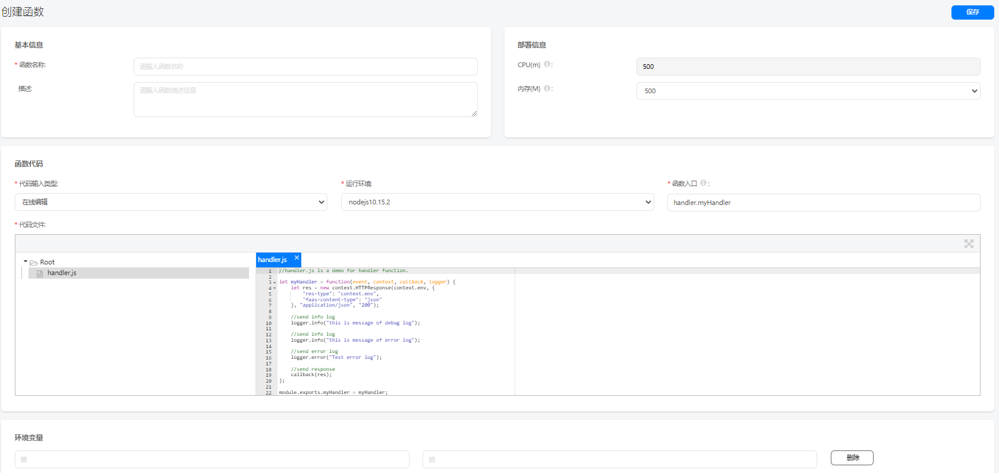
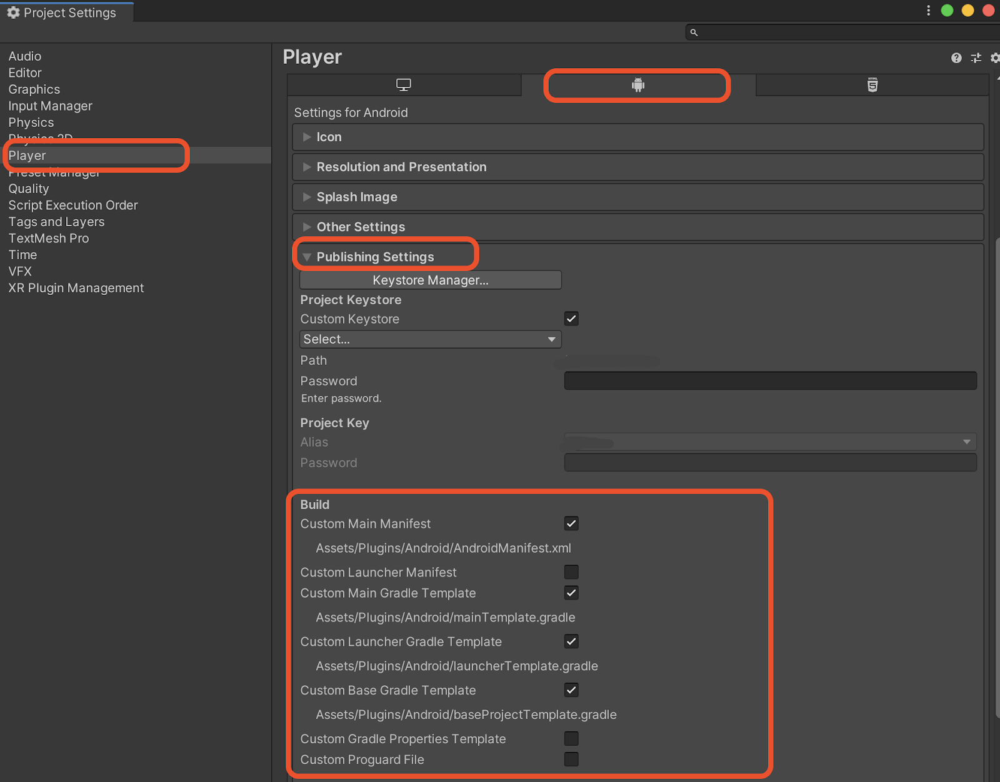
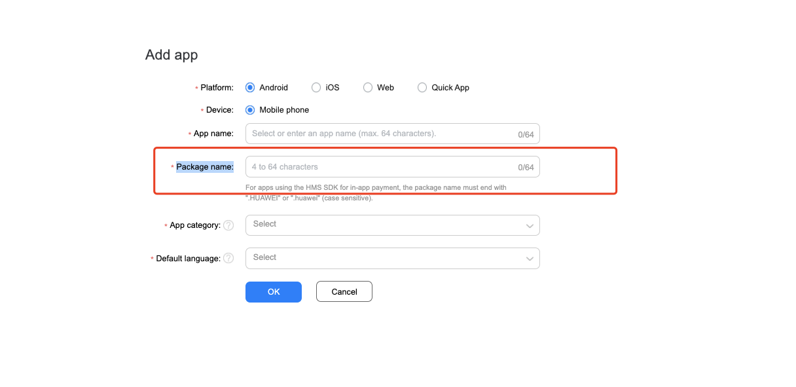

# 云函数（AGC）

## 业务介绍

云函数是一项Serverless计算服务，提供FaaS（Function as a Service）能力，可以帮助开发者大幅简化应用开发与运维相关的事务，降低应用功能的实现门槛，快速构建业务能力。

### 主要功能

*   云函数提供了高效可靠的函数开发与运行框架，替开发者完全解决传统应用开发与运维中的诸多复杂事务（如服务器配置与管理、代码部署、负载均衡、弹性伸缩、高可用保证等等），开发者只需聚焦业务逻辑、开发并上传函数代码，即可构建高可用、可伸缩的Serverless应用。
*   云函数作为Serverless的核心与枢纽，支持方便连接和扩展周边云服务能力，开发者可以像拼搭积木一样自由便捷地组织各项服务来实现业务逻辑。

### 相关概念

*   函数：在云函数中运行的脚本或程序，处理事件并返回响应。
*   事件源：AGC中的其他服务（如云数据库），或者开发者自定义服务。事件源可以发布多种类型事件，以触发函数的执行。
*    触发器：按照配置（事件源 、事件类型、函数的映射关系），监听事件源上的指定类型事件，当事件发生时自动调用函数，将事件数据提交给函数处理。
*   别名：开发者可以为函数创建一个或多个别名，其作用类似于指向特定函数版本的指针。函数调用方（含触发器）通过使用别名，可以访问别名指向的函数。

### 应用场景

通过云函数，开发者能够运行函数代码以响应关注的事件，典型的应用场景大致可分为以下几类：

*   向用户发送某些事件通知
*   执行数据库清理和维护任务
*   在云端执行密集型任务
*   集成第三方服务和API

### 申请开通服务

函数服务当前仍处于Beta开放状态，在使用此服务前，您需要向agconnect@huawei.com发送申请邮件，申请开通云函数服务。

邮件标题请使用如下格式：“[云函数]-[公司名称]-[开发者帐号ID]-[项目ID]”，开发者帐号ID及项目ID查询方法可参见[查询开发者帐号ID及项目ID](https://developer.huawei.com/consumer/cn/doc/development/AppGallery-connect-Guides/agc-query-ID)。

在收到您的申请后，华为运营人员会在1-3个工作日内给您答复。


### 如何收费

云函数属于资源消耗型服务，未来会基于调用次数、内存和网络占用情况来进行收费。目前云函数功能处于Beta测试期间，您可以免费使用。我们会在正式收费前一个月邮件通知并公告相关策略及费率。


## 华为账号设置


### 使用入门

一个典型的函数开发流程如下：

1. 集成SDK：如果需要在应用客户端中调用云函数，则必须集成云函数的客户端SDK。
2. 创建函数：需要在AGC中创建函数，并添加函数执行的代码。
3. 测试函数：AGC提供了函数测试功能，可以直接测试函数代码。
4. 调用函数：创建函数后可以在需要触发函数功能时调用函数，支持触发器调用和应用客户端调用。
5. 监控函数：AGC提供了函数监控功能，可以查看函数的调用次数、执行成功率等。


### 集成云函数SDK

在将Cloud Function SDK集成到您的应用程序之前，您必须先集成AppGallery Connect SDK和插件。有关详细信息，请参阅[AppGallery Connect快速入门](https://developer.huawei.com/consumer/en/doc/development/AppGallery-connect-Guides/agc-get-started)。


### 创建函数

1. 登录[AppGallery Connect网站](https://developer.huawei.com/consumer/cn/service/josp/agc/index.html)，点击 **我的项目**。

2. 在项目列表中找到您的项目，在项目下的应用列表中选择您的应用。

   


3. 选择 **构建 > 云函数**，进入 **Cloud Functions** 页面。

4. 如果云函数尚未开通，需点击 **立即开通** 。

      

   **注意：**

   由于开通服务时可能需要设置数据存储位置，设置数据存储位置后会刷新 `agconnect-services.json` 文件里的配置。如果您开通服务时设置了数据存储位置，在开通完成后您需要重新下载 `agconnect-services.json` 文件并集成到您的工程中，具体操作参见[添加配置文件](https://developer.huawei.com/consumer/cn/doc/development/AppGallery-connect-Guides/agc-get-started#addjson)。

5. 在Unity Application中配置json文件。

    将`agconnect-services.json`文件复制到Unity项目的`Assets/Plugins/Android`文件夹。

      

      


6. 在 **函数** 页面，点击 **创建函数**。

   

7. 在创建界面中，完成函数定义。

   *   “函数名称”和“描述”栏输入函数名称与描述。

   *   “代码输入类型”选择“在线编辑”或“*.zip文件”，选择“在线编辑”可以直接在“代码文件”中编辑函数的代码，AGC提供了默认的myHandler函数代码可供您编辑时参考。

   *   “部署信息”中输入部署信息，可使用默认配置。

   *   “环境变量”中输入调用函数时需要传入的变量信息。

   有关函数的详细配置信息说明，请参见[配置函数](https://developer.huawei.com/consumer/cn/doc/development/AppGallery-connect-Guides/agc-cloudfunction-config)。有关函数代码的编辑方法，请参考[编程模型](https://developer.huawei.com/consumer/cn/doc/development/AppGallery-connect-Guides/agc-cloudfunction-programmode)。

   

   下面的示例代码实现单个Sum函数：

   ```
   //handler.js is a demo for handler function.
   
   let myHandler = function(event, context, callback, logger) {
       
       let res = new context.HTTPResponse(context.env, {
           "res-type": "context.env", 
           "faas-content-type": "json"
       }, "application/json", "200");
   
       var number; 
       if (event.body) { 
           var _body = JSON.parse(event.body); 
           number = _body.number; 
       } else {
           number = event.number; 
       }
       var sum = number.number2 + number.number1;
      
       res.body = {
           "result": sum
       };
       context.callback(res);
   };
   
   module.exports.myHandler = myHandler;
   
   ```


8. 函数创建完成后，点击 **保存**。

## 创建Unity CloudFunction Android应用程序

### 设置 unity 自定义Android manifest and gradle

1. 在player setting中将平台切换到android

2. 在player setting中启用 custom manifest and gradle. 以下版本是unity **2019.4**

   

   安卓的结构在 Unity **2019.3 **版本进行了更新, manifest 和 gradle 被分到了多个文件 (Main, Launcher & Base)。

3. 设置Package name

   在  **Edit -> Project Settings -> Player ->  Android(icon) -> other settings -> Identification -> Package Name** 中设置Package name。

   Package Name即为华为项目中应用程序的Package Name。

    

### 启用配置并将其添加到项目Gradle

进入 **Edit -> Project Settings -> Player -> Android(icon) -> Publishing Settings -> Build**

启用 **Custom Base Gradle Template** 并在文件中添加 AppGallery Connect plugin 和 Maven repository。路径是`Assets/Plugins/Android/baseProjectTemplate.gradle`。

```
    allprojects {
        buildscript {
            repositories {
...
                maven { url 'https://developer.huawei.com/repo/' }
            }
           dependencies {
                classpath 'com.android.tools.build:gradle:3.4.0'
                classpath 'com.huawei.agconnect:agcp:1.4.1.300'
           }
...
        }
...
        repositories {
...
            maven { url 'https://developer.huawei.com/repo/' }
...
        }
    }
```

### 启用配置并将其添加到应用程序gradle


进入 **Edit -> Project Settings -> Player -> Android(icon) -> Publishing Settings -> Build**，启用 **Custom Launcher Gradle Template** 并在 `launcherTemplate.gradle` 中添加依赖。路径为 `Assets/Plugins/Android/LauncherTemplate.gradle`。


```
apply plugin: 'com.huawei.agconnect'

dependencies {
...
   implementation project(':unityLibrary')
   implementation 'com.android.support:appcompat-v7:28.0.0'
...
   }
```


添加CloudFunction Kit：


```
  dependencies {
…
   implementation 'com.huawei.agconnect:agconnect-core:1.2.0.300'
   implementation "com.huawei.agconnect:agconnect-function:1.4.2.300"
   implementation 'com.fasterxml.jackson.core:jackson-databind:2.8.5'
   implementation 'com.fasterxml.jackson.core:jackson-core:2.8.5'
   implementation 'com.fasterxml.jackson.core:jackson-annotations:2.8.5'
...
}
```

**早期版本**

如果Unity版本是**2019.2或更早版本**，则应在`MainGradleTemplate.gradle`中添加工具和其他配置。


```
buildscript {
            repositories {
...
                maven { url 'https://developer.huawei.com/repo/' }
...
            }
        dependencies {
            classpath 'com.android.tools.build:gradle:3.4.0'
            classpath 'com.huawei.agconnect:agcp:1.4.1.300'
       }

...
        }
…
allprojects {
        repositories {
...
            maven { url 'https://developer.huawei.com/repo/' }
...
        }
    }
…
apply plugin: 'com.huawei.agconnect'

dependencies {
...
   implementation 'com.android.support:appcompat-v7:28.0.0'
   implementation 'com.android.support:appcompat-v7:28.0.0'
   implementation 'com.huawei.agconnect:agconnect-core:1.2.0.300'
   implementation "com.huawei.agconnect:agconnect-function:1.4.2.300"
   implementation 'com.fasterxml.jackson.core:jackson-databind:2.8.5'
   implementation 'com.fasterxml.jackson.core:jackson-core:2.8.5'
   implementation 'com.fasterxml.jackson.core:jackson-annotations:2.8.5'
...
   }
```

## SDK集成开发

### 设置场景

1. 新建一个场景

   

2. 右键单击并选择UI，然后选择button:

   

3. 将Component添加到button并开发脚本：

    
    
    

4. 编辑脚本:

    
    
    双击脚本文件，然后您将在VS code中打开它
    
    

5. 使用CloudFunction 接口

    定义将用作输入和输出参数的模型类。

    

    初始化AGConnectFunction实例，并使用上面创建的http触发器调用Wrap。然后，创建一个异步任务，并绑定onCompleteListener以处理函数结果。

    

6. 绑定脚本中的按钮和界面

    

   - 步骤1：点击“ +”添加功能
   
   - 步骤2：选择具有您要使用的界面的对应场景
   
   - 步骤3：单击“No Function”以选择脚本，然后选择相应的函数

     

### 测试函数

函数创建后，您可以在AGC中测试函数的代码运行是否正常。

1. 在函数列表页面点击已创建的函数名称，进入函数详情页面进行测试。

2. 完成测试后，可在函数测试页面查看测试结果。

有关函数测试的更详细说明，请参见[测试函数](https://developer.huawei.com/consumer/cn/doc/development/AppGallery-connect-Guides/agc-cloudfunction-test)。

例如，您可以通过这些参数来测试上面的Sum函数：


### 调用函数

函数创建并测试成功后，您即可在您的应用程序中调用函数，调用函数分为两种方法。

*   触发器调用：在函数中创建触发器，触发器触发时自动调用函数，详细方法参见[触发器调用](https://developer.huawei.com/consumer/cn/doc/development/AppGallery-connect-Guides/agc-cloudfunction-triggercall)。

*   应用客户端调用：在应用的客户端程序中使用云函数SDK的API调用，详细方法参见[应用客户端调用](https://developer.huawei.com/consumer/cn/doc/development/AppGallery-connect-Guides/agc-cloudfunction-appcall)。

**注意：**

应用客户端调用函数必须在函数或函数别名中创建一个HTTP类型的触发器。

调用函数时建议使用函数发布的版本或别名，参见[版本管理](https://developer.huawei.com/consumer/cn/doc/development/AppGallery-connect-Guides/agc-cloudfunction-version)和[别名管理](https://developer.huawei.com/consumer/cn/doc/development/AppGallery-connect-Guides/agc-cloudfunction-aliasname)。


### 监控函数

在函数列表界面中，点击“监控”，进入函数监控界面，开发者可以监控函数的相关指标。

*   函数调用次数
*   函数执行时延，包括最小时延、最大时延、平均时延
*   函数执行成功率
*   函数失败次数

