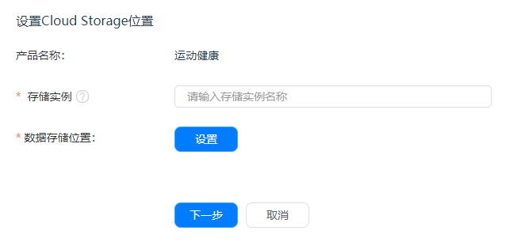
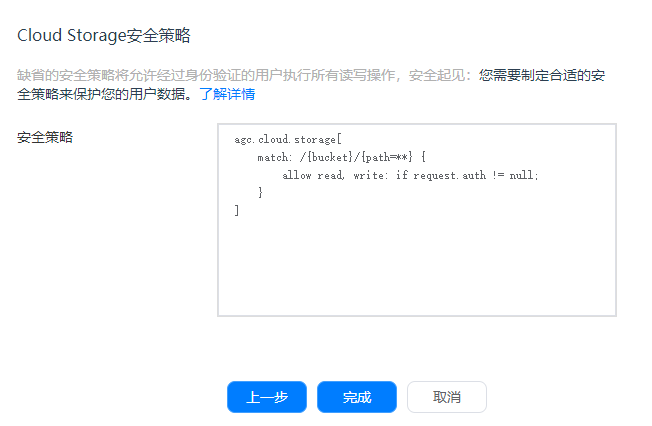
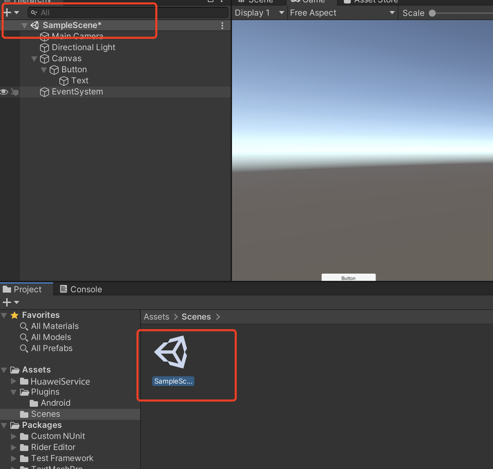

# 云存储（AGC）

## 业务介绍

### 概述

云存储是专为开发者打造的可伸缩、免维护的云端存储服务，您可以用于存储图片、音频、视频或其他由用户生成的内容。

云存储具备稳定、安全、高效、易用的特点，开发者无需关心存储服务器的开发、部署、运维、扩容等事务，及可用性、可靠性、持久性等指标，降低应用使用存储的门槛，让开发者可专注于业务能力的构建、运营和提升用户口碑。

### 优势

云存储SDK提供简单、安全、高效、健壮的API接口，开发者使用支持云存储的SDK来存储图片、视频、音频或用户生成的其他类型文件。

*   全流程使用HTTPS协议对用户的传输数据进行加密保护，并采用安全的加密协议将文件加密存储在云端。

*   因网络原因或用户原因导致的操作中止，只需要简单的传入操作中止的位置，就可以尝试重新开始该操作。

*   提供EB级的数据存储，解决开发者海量数据存储的难题。

*   开发者简单的判断返回异常就可以定位出错误原因，定位快捷方便。

### 工作原理

使用云存储服务提供的SDK，可以向云存储空间上传文件，云存储服务将您上传的文件存储在默认的存储实例中，您可以通过AppGallery Connect（简称AGC）访问这些文件。当然，您还可以使用云存储SDK的API执行下载、删除、管理文件等操作。

### 申请测试资格

云存储服务当前仍处于Beta开放状态，在使用此服务前，您需要向agconnect@huawei.com发送申请邮件，申请开通云存储服务。

邮件标题请使用如下格式：“[云存储]-[_公司名称_]-[开发者帐号_ID_]-[项目_ID_]”，开发者帐号ID及项目ID查询方法可参见[查询开发者帐号ID及项目ID](https://developer.huawei.com/consumer/cn/doc/development/AppGallery-connect-Guides/agc-query-ID)。

在收到您的申请后，华为运营人员会在1-3个工作日内给您答复。


### 如何收费

云存储属于资源消耗型服务，未来会基于存储量、流量、请求操作次数等情况进行收费。目前云存储服务处于Beta测试阶段，采取限量免费的策略，您可以在一定配额内免费使用。


## 华为账号设置

注意：Beta版目前仅支持中国和新加坡站点。如有任何更改，请注意网站通告。


### 申请开通服务

云存储服务当前仍处于Beta开放状态，在使用此服务前，您需要向agconnect@huawei.com发送申请邮件，申请开通云存储服务。

邮件标题请使用如下格式：“[云存储]-[_公司名称_]-[开发者帐号_ID_]-[项目_ID_]”，开发者帐号ID及项目ID查询方法可参见[查询开发者帐号ID及项目ID](https://developer.huawei.com/consumer/cn/doc/development/AppGallery-connect-Guides/agc-query-ID)。

在收到您的申请后，华为运营人员会在1-3个工作日内给您答复。

**注意：**

本邮箱地址仅处理AGC服务开通申请，其他咨询类问题请勿发送至本邮箱。


### 创建项目和添加应用

如果您尚未添加项目，请在[AppGallery Connect 网站](https://developer.huawei.com/consumer/cn/service/josp/agc/index.html)先创建您的AGC项目并在项目下添加应用，具体请参见[Android使用入门](https://developer.huawei.com/consumer/cn/doc/development/AppGallery-connect-Guides/agc-get-started#createproject)。


### 接入认证服务

具体请参考[认证服务开发指南](https://developer.huawei.com/consumer/cn/doc/development/AppGallery-connect-Guides/agc-auth-introduction-0000001053732605)。


### 启用服务

首次使用云存储服务前，需要先启用此服务。如果您已经启用，可跳过本步骤。

1. 登录[AppGallery Connect网站](https://developer.huawei.com/consumer/cn/service/josp/agc/index.html)，点击“我的项目”。

2. 在项目列表中找到您的项目，在项目下的应用列表中选择需要启用App Linking的应用。

3. 选择 **构建 > 云存储**，进入云存储页面，点击 **立即开通**。

4. 在引导界面输入存储实例名称和选择“数据存储位置”。

   

5. 单击 **下一步**，进入默认安全策略设置界面。

   

6. 单击 **完成**，开通存储成功。


## Unity项目设置

1. 在player setting中启用 custom manifest and gradle. 以下版本是unity **2019.4**

2. 添加配置文件并集成AppGallery Connect SDK。

   有关详细信息，请参阅[集成AppGallery Connect SDK](https://developer.huawei.com/consumer/en/doc/development/AppGallery-connect-Guides/agc-get-started#agcsdk)。

   注意：
   启用Cloud Storage后，在集成AppGallery Connect的Cloud Storage SDK之前，请转到 **我的项目>项目设置>常规信息**，并在App信息区域中下载`agconnect-services.json`文件，然后检查是否已在该服务下设置了文件的 `default_storage ->cloudstorage`部分。否则，SDK将无法找到用于初始化的默认存储实例，您需要在文件部分添加`default_storage`以设置默认存储实例。 `default_storage`的值是在 **项目设置>构建>云存储** 页面上的存储实例框中输入的名称。
  
   ```
   "cloudstorage":{  
   "default_storage":"Name of the storage instance to be used by default."
   "storage_url":"https://agc-storage-drcn.platform.dbankcloud.cn"  
   }
   ```

3. 集成Cloud Storage SDK。

   将Cloud Storage SDK的Maven存储库地址添加到app级别的`launcherTemplate.gradle`文件（通常在app目录中）。

   ```
   implementation "com.huawei.agconnect:agconnect-storage:1.3.1.200"
   implementation 'com.huawei.agconnect:agconnect-core:1.4.2.300'
   implementation 'com.huawei.agconnect:agconnect-credential:1.6.1.300'
   implementation 'com.huawei.agconnect:agconnect-auth:1.6.1.300'
   ```

4. 要读取和写入文件并访问网络，您需要在`AndroidMainfest.xml`文件中配置以下权限：

   ```
   <uses-permission android:name="android.permission.INTERNET" />
   <uses-permission android:name="android.permission.ACCESS_NETWORK_STATE" />
   <uses-permission android:name="android.permission.WRITE_EXTERNAL_STORAGE" />
   <uses-permission android:name="android.permission.READ_EXTERNAL_STORAGE" />
   ```

5. 如果您的应用程序用的是Android SDK 29或更高版本集成，则还需要在`AndroidMainfest.xml`的application下添加以下属性：

   ```
   <application
      android:name=".App"
      android:allowBackup="false"
      android:requestLegacyExternalStorage="true"
   ```

6. 设置Package name

   在 **Edit -> Project Settings -> Player ->  Android(icon) -> other settings** 中

   

   设置与您的json文件相对应的Package name，并且目标api级别应低于29。
   
   （如果目标api级别高于29，请参考[使用入门](https://developer.huawei.com/consumer/cn/doc/development/AppGallery-connect-Guides/agc-cloudstorage-getstarted).4 ）

## SDK集成开发

### 设置场景

1. 新建一个场景

   

2. 右键单击并选择UI，然后选择按钮:

   

3. 将组件添加到按钮并开发脚本：

   

   

4. 编辑脚本:

   

   双击脚本文件，您将在VS code中打开它。

   

5. 使用API

   ```
   void Start()
   {
      deleteFile();
   }
   
   // Update is called once per frame
   void Update()
   {
     
   }
   
   void deleteFile()
   {
   	AGCStorageManagement mAGCStorageManagement = mAGCStorageManagement = AGCStorageManagement.getInstance();
   
   	StorageReference reference = mAGCStorageManagement.getStorageReference("addOnCompleteListenerTest.data");
   
   	reference.delete();
   	Debug.Log("DeleteFileTest success.");
   
   }
   
   ```

   用上述代码创建函数

6. 绑定脚本中的按钮和接口

   

   - 步骤1：点击“ +”添加功能
   
   - 步骤2：选择具有您要使用的界面的对应场景
   
   - 步骤3：单击“No Function”以选择脚本，然后选择相应的函数

        

### 示例项目

如何使用示例项目？

1. 从以下位置创建存储库：[https://github.com/Unity-Technologies/unity-hms_sdk/tree/cloud_storage_test](https://github.com/Unity-Technologies/unity-hms_sdk/tree/cloud_storage_test) 并checkout“ cloud_storage_test”分支。

2. 从您的远程项目中替换agconnect-services.json文件并配置gradle文件，请参阅第3部分：如何将AppGallery Connect SDK集成到Unity项目中？

3. 打开Unity Hub，添加HuaweiService项目（Unity版本2019.3+）。

   **注意: **<br>如果编辑器版本不匹配，请单击继续

   

4. 将平台切换到Android并打开性能测试场景：`Assets/HuaweiHmsDemo/HmsPerformanceSampleTest`

   如果有这样的编译错误：
   >Microsoft (R) Visual C# Compiler version 2.9.1.65535 (9d34608e)
   >Copyright (C) Microsoft Corporation. All rights reserved.
   > error CS0009: Metadata file '/Users/yanmeng/Desktop/unity_agc_new/unity-hms_sdk/hmsDemo/Library/ScriptAssemblies/Unity.Timeline.Editor.dll' could not be opened -- Image is too small.
   > Assets/HuaweiHms/src/hms/Wrapper/fundation/HmsClass.cs(72,25): warning CS0693: Type parameter 'T' has the same name as the type parameter from outer type 'HmsClass<T>'
   重新打开该项目可以解决此问题。
   
5. 设置Android build keystore

   在 **Build Settings -> Android -> PlayerSettings-> Publish Settings** 中。如下所示。 hhmm的密码为123456。
   
   

6. 生成android apk并在Android设备上运行。

   在下载测试之前，请检查您是否已在测试设备中获得读/写权限。
   
   

