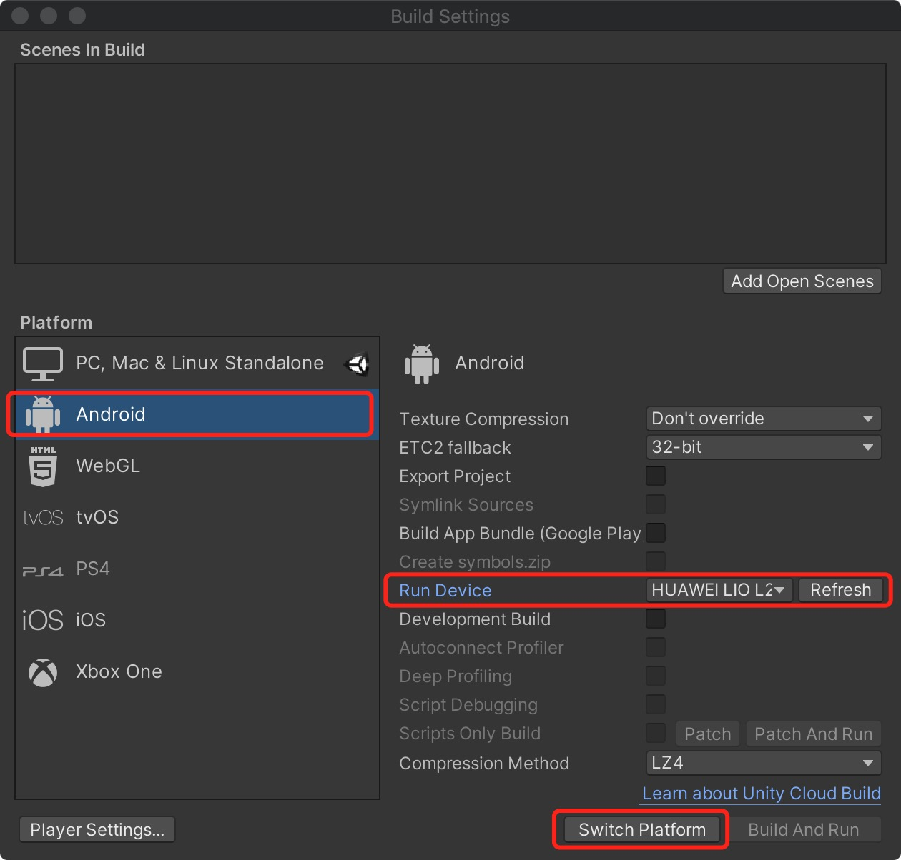
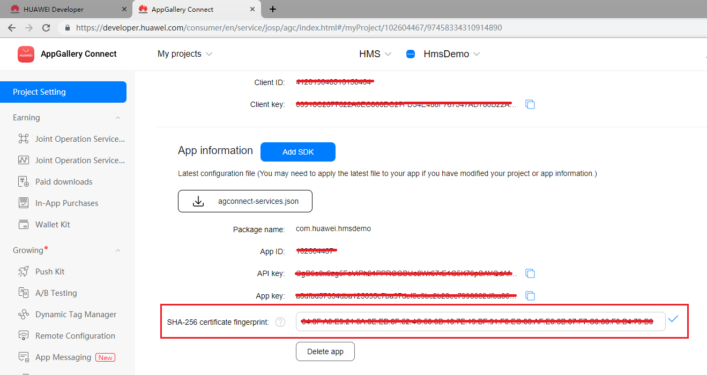

# 广告服务 (HMS)

## 业务介绍

广告服务（Ads Kit）依托华为终端平台与数据能力为您提供的流量变现服务，帮助您解决流量变现的难题；同时为广告主提供广告服务，配合华为终端平台向用户提供更加个性化的营销活动或商业广告。

### 流量变现服务

HUAWEI Ads流量变现服务（HUAWEI Ads Publisher Service，以下简称为流量变现服务）是广告服务依托华为终端强大的平台与数据能力为您提供的App流量变现服务，您通过该服务可以在自己的App中获取并向用户展示精美的、高价值的广告内容，并从中获得广告收益。

为满足App不同场景下的内容体验需要，HUAWEI Ads流量变现服务为您提供了[Banner广告](https://developer.huawei.com/consumer/cn/doc/development/HMSCore-Guides-V5/publisher-service-banner-0000001050066915-V5)、[原生广告](https://developer.huawei.com/consumer/cn/doc/development/HMSCore-Guides-V5/publisher-service-native-0000001050064968-V5)、[激励广告](https://developer.huawei.com/consumer/cn/doc/development/HMSCore-Guides-V5/publisher-service-reward-0000001050066917-V5)、[插屏广告](https://developer.huawei.com/consumer/cn/doc/development/HMSCore-Guides-V5/publisher-service-interstitial-0000001050064970-V5)、[开屏广告](https://developer.huawei.com/consumer/cn/doc/development/HMSCore-Guides-V5/publisher-service-splash-0000001050066919-V5)、[贴片广告](https://developer.huawei.com/consumer/cn/doc/development/HMSCore-Guides-V5/publisher-service-instream-0000001058253743-V5)六种广告形式；为了更好的支撑您在华为设备上集成华为广告服务，我们提供了HUAWEI Ads SDK，您可以根据适合的场景选择不同的广告类型集成到App中，使用广告服务平台提供的高品质广告服务，实现流量变现。

为满足您获取流量变现收益数据（请求量、返回量、点击率、展示率等）的需求，我们给您提供获取流量变现报表的接口，即[流量变现服务报表API](https://developer.huawei.com/consumer/cn/doc/development/HMSCore-Guides-V5/reporting-api-dev-process-0000001051294727-V5)。

### 广告标识服务

Ads Kit提供广告标识符和转化跟踪能力方便广告平台和广告主进行个性化广告投放和广告转化渠道跟踪。

- 广告标识符（OAID）是一种非永久性设备标识符，基于广告标识符，可在保护用户个人数据隐私安全的前提下，向用户提供个性化广告，同时三方监测平台也可以向广告主提供转化归因分析。

- App转化跟踪参数（Install Referrer）：您和广告主可通过华为开放的API，获得App转化跟踪参数，广告主可基于转化跟踪参数进行App推广渠道分析，方便广告主清楚掌握各渠道转化效果分析。

### 场景介绍

- 流量变现服务

  支持开发者基于六种广告形式不同场景的设计需求。具体详情请参见下方表格。 

  | <div style="width:80px">广告形式</div>                       | 媒体类型                | 应用场景                                                     |
  | ------------------------------------------------------------ | ----------------------- | ------------------------------------------------------------ |
  | [Banner广告](https://developer.huawei.com/consumer/cn/doc/development/HMSCore-Guides-V5/publisher-service-banner-0000001050066915-V5) | 图片                    | 以通栏式或矩形式固定展示在应用内页面顶部、中部或底部，适合用于用户停留较久或者访问频繁的页面。 |
  | [原生广告](https://developer.huawei.com/consumer/cn/doc/development/HMSCore-Guides-V5/publisher-service-native-0000001050064968-V5) | 图片、视频              | 界面内插入广告，与媒体内容无缝融合。                         |
  | [激励广告](https://developer.huawei.com/consumer/cn/doc/development/HMSCore-Guides-V5/publisher-service-reward-0000001050066917-V5) | 视频                    | 游戏通关、复活、获取道具、积分、继续机会、人物技能升级时展示。 |
  | [插屏广告](https://developer.huawei.com/consumer/cn/doc/development/HMSCore-Guides-V5/publisher-service-interstitial-0000001050064970-V5) | 图片、视频              | 游戏或流媒体开启、暂停、过关、跳转、加载、退出时弹出。       |
  | [开屏广告](https://developer.huawei.com/consumer/cn/doc/development/HMSCore-Guides-V5/publisher-service-splash-0000001050066919-V5) | 静态图片、GIF动图、视频 | 打开App时，以开屏形式全屏展现，展示时长3s，展示完毕后自动关闭并进入应用主页面。 |
  | [贴片广告](https://developer.huawei.com/consumer/cn/doc/development/HMSCore-Guides-V5/publisher-service-instream-0000001058253743-V5) | 图片、视频              | 前贴：视频播放前。中贴：视频播放中。后贴：视频播放结束后或播放结束前xx秒。 |

- 广告标识服务

  支持广告平台、开发者、三方监测平台及广告主基于不同场景的使用，具体详情请参见[场景介绍](https://developer.huawei.com/consumer/cn/doc/development/HMSCore-Guides-V5/identifier-service-use-cases-0000001050064978-V5)。

## Unity项目集成设置

### 注册认证

在开始之前，首先您需要创建华为开发者账号，项目，以及App。请参考[华为HMS文档](https://developer.huawei.com/consumer/cn/doc/development/HMS-Guides/Preparations) 


我们默认您已经创建并拥有了华为HMS项目，以及对应的App信息

### 创建应用

在您的Unity项目中完成以下构建环境的设置，以便使用华为HMS SDK构建安卓 APK。


进入 **Editor -> Build Settings -> Platform -> Andriod**， 点击 **Switch Platform** 切换到安卓平台。



进入 **Player Settings -> Publishing Settings**，勾选以下环境配置项目。


### 开发准备

按照[华为HMS 集成开发指南介绍](https://developer.huawei.com/consumer/cn/codelab/HMSPreparation/index.html#6)，我们仍需要对这些Gradle文件做进一步开发准备的设置。


您可以根据[华为HMS Core集成准备](https://developer.huawei.com/consumer/cn/codelab/HMSPreparation/index.html#6)对自己对文件进行配置。您也可以从我们的[示例项目](https://github.com/Unity-Technologies/HMSSDKSample/tree/master/Assets/Plugins/Android)中的具体参数设置，进行参考与对比，完成以下一系列的开发准备配置。

1. 启用并对 `AndroidManifest.xml` 做以下配置

   进入 **Edit -> Project Settings -> Player -> Android(icon) -> Publishing Settings -> Build**，启用 **Custom Main Manifest**

   如果您的Unity版本低于**2019.2（含）**，上述设置界面中并没有 **AndroidManifest** 选项，但您可以将`AndroidManifest.xml`文件手动放置到`Assets/Plugins/Android` 路径下。

   ```
    <?xml version="1.0" encoding="utf-8"?>
       <!-- GENERATED BY UNITY. REMOVE THIS COMMENT TO PREVENT OVERWRITING WHEN EXPORTING AGAIN-->
    <manifest
           xmlns:android="http://schemas.android.com/apk/res/android"
           package="com.unity3d.player"
           xmlns:tools="http://schemas.android.com/tools">
           <uses-permission android:name="android.permission.ACCESS_COARSE_LOCATION"/>
           <uses-permission android:name="android.permission.ACCESS_FINE_LOCATION"/>
           <uses-permission android:name="android.permission.ACCESS_BACKGROUND_LOCATION" />
           <uses-permission android:name="com.huawei.hms.permission.ACTIVITY_RECOGNITION" />
           <uses-permission android:name="android.permission.ACTIVITY_RECOGNITION" />
           <uses-permission android:name="android.permission.ACCESS_MOCK_LOCATION" />
           <application>
               <activity android:name="com.hms.hms_analytic_activity.HmsAnalyticActivity"
                       android:theme="@style/UnityThemeSelector">
                   <intent-filter>
                       <action android:name="android.intent.action.MAIN" />
                       <category android:name="android.intent.category.LAUNCHER" />
                   </intent-filter>
                   <meta-data android:name="unityplayer.UnityActivity" android:value="true" />
               </activity>
               <service
                   android:name="com.unity.hms.push.MyPushService"
                   android:exported="false">
                   <intent-filter>
                       <action android:name="com.huawei.push.action.MESSAGING_EVENT"/>
                   </intent-filter>
               </service>
               <receiver
                       android:name="com.unity.hms.location.LocationBroadcastReceiver"
                       android:exported="true">
                   <intent-filter>
                       <action android:name="com.huawei.hmssample.location.LocationBroadcastReceiver.ACTION_PROCESS_LOCATION" />
                   </intent-filter>
               </receiver>
               <receiver
                       android:name="com.unity.hms.location.GeoFenceBroadcastReceiver"
                       android:exported="true">
                   <intent-filter>
                       <action android:name="com.huawei.hmssample.geofence.GeoFenceBroadcastReceiver.ACTION_PROCESS_LOCATION" />
                   </intent-filter>
               </receiver>
           </application>
       </manifest>
   ```


2. 启用并对project gradle文件添加配置

   进入 **Edit -> Project Settings -> Player -> Android(icon) -> Publishing Settings -> Build** ，启用 **Custom Base Gradle Template** 并在文件中添加 AppGallery Connect plugin 和 Maven repository。路径是`Assets/Plugins/Android/baseProjectTemplate.gradle`。

   如果您的Unity版本低于**2019.2（含）**，则需要在 <code>MainGradleTemplate.gradle</code> 中添加配置。

   ```
       allprojects {
           buildscript {
               repositories {**ARTIFACTORYREPOSITORY**
                   google()
                   jcenter()
                   maven { url 'https://developer.huawei.com/repo/' }
               }
   
               dependencies {
                   // If you are changing the Android Gradle Plugin version, make sure it is compatible with the Gradle version preinstalled with Unity
                   // See which Gradle version is preinstalled with Unity here https://docs.unity3d.com/Manual/android-gradle-overview.html
                   // See official Gradle and Android Gradle Plugin compatibility table here https://developer.android.com/studio/releases/gradle-plugin#updating-gradle
                   // To specify a custom Gradle version in Unity, go do "Preferences > External Tools", uncheck "Gradle Installed with Unity (recommended)" and specify a path to a custom Gradle version
                   classpath 'com.android.tools.build:gradle:3.4.0'
                   classpath 'com.huawei.agconnect:agcp:1.2.1.301'
                   **BUILD_SCRIPT_DEPS**
               }
           }
   
           repositories {**ARTIFACTORYREPOSITORY**
               google()
               jcenter()
               flatDir {
                   dirs "${project(':unityLibrary').projectDir}/libs"
               }
               maven { url 'https://developer.huawei.com/repo/' }
           }
       }
   
       task clean(type: Delete) {
           delete rootProject.buildDir
       }
   ```
   
3. 启用并对app gradle文件添加配置

   进入 **Edit -> Project Settings -> Player -> Android(icon) -> Publishing Settings -> Build**，启用 **Custom Launcher Gradle Template** 并在 `launcherTemplate.gradle` 中添加依赖。路径为 `Assets/Plugins/Android/LauncherTemplate.gradle`。

    如果您的Unity版本低于**2019.2（含）**， 则需要在 <code>MainGradleTemplate.gradle</code>中添加配置。
   
   ```
       dependencies {
           implementation project(':unityLibrary')
           implementation 'com.huawei.hms:ads-lite:13.4.29.303'
           implementation 'com.huawei.hms:ads-consent:3.4.30.301'
           implementation 'com.huawei.hms:push:4.0.3.301'
           implementation 'com.huawei.hms:hianalytics:5.1.0.300'
           implementation 'com.android.support:appcompat-v7:28.0.0'
           implementation 'com.huawei.hms:hianalytics:5.0.0.301'
           implementation 'com.huawei.agconnect:agconnect-core:1.6.1.300'
           implementation 'com.huawei.hms:base:6.2.0.300'
           implementation 'com.huawei.hms:hwid:6.1.0.303'
           implementation 'com.huawei.hms:game:6.1.0.301'
           }
   ```

4. 使用并对unity library gradle文件进行以下设置

    进入 **Edit -> Project Settings -> Player -> Android(icon) -> Publishing Settings -> Build**，启用 **Custom Main Gradle Template** 并在 `mainTemplate.gradle` 中添加依赖。路径为 `Assets/Plugins/Android/mainTemplate.gradle.gradle`。
    
    如果您的Unity版本低于**2019.2（含）**， 则需要在 <code>MainGradleTemplate.gradle</code>中添加配置。
    
    ```
        dependencies {
            implementation fileTree(dir: 'libs', include: ['*.jar'])
            implementation 'com.huawei.hms:hianalytics:5.0.0.301'
            implementation 'com.huawei.agconnect:agconnect-core:1.6.1.300'
            implementation 'com.huawei.hms:base:6.2.0.300'
            implementation 'com.huawei.hms:hwid:6.1.0.303'
            implementation 'com.huawei.hms:game:6.1.0.301'
        **DEPS**}
    ```
5. 创建Signature

   进入 **Edit -> Project Settings -> Player -> Android(icon) -> Publishing Settings -> Keystore Manager**， 点击 **Keytore... -> create new**

   

   您需要在打开unity时设定并输入密码，否则将无法构建。无需在 gradle 中添加signature。

6. 签署证书指纹

   参照华为[HMS Core集成准备 Step4](https://developer.huawei.com/consumer/cn/codelab/HMSPreparation/index.html#3) 生成SHA256证书指纹

   

   参照华为[HMS Core集成准备 Step5](https://developer.huawei.com/consumer/cn/codelab/HMSPreparation/index.html#4)在AppGAllery Connect里添加指纹。

   

7. 设置package name，及其他设置

   进入 **Edit -> Project Settings -> Player**设置package name。

   package name格式为 `com.${Company Name}.${Product Name}`

   同时也可以在此步骤完成其余的所需设置，比如您的应用版本号、应用的图标、设置显示的分辨率等。

   

8. `Agconnect-services.json`

   我们还需要从华为开发者账号内下载这个json文件，加入所需信息后，放到 `Assets/Plugins/Android` 路径下。

   从华为开发者账号内下载此json 文件并在其中加以下信息。同样的，您可以在我们的[示例项目文件](https://github.com/Unity-Technologies/HMSSDKSample/blob/master/Assets/Plugins/Android/agconnect-services.json)中直接参考！

   ```
   "agcgw":{
   "backurl":"connect-drcn.dbankcloud.cn",
   "url":"connect-drcn.hispace.hicloud.com"
   },
   ```

   当我们使用“分析服务”、“推送服务”、或“定位服务”时，必须配置 `agconnect-services.json` 文件。

   参考 [链接](https://developer.huawei.com/consumer/cn/doc/development/HMSCore-Guides/android-config-agc-0000001050170137) 以创建`agconnect-services.json`

   

9. 获取activity

   可以用 `Common.GetActivity()`函数来获取activity。

## SDK集成开发
### SDK开发

HMS 套件中共包括4个功能服务，在[示例项目](https://github.com/Unity-Technologies/HMSSDKSample)中都有相应的示例场景。 为了进行测试，您需要通过HMS将其构建到Android移动版上。 确保已创建HMS帐户和项目。 然后，您就可以更改配置并测试不同的功能。


在示例项目中，广告服务对应的场景是： `Assets/HuaweiServiceDemo/Scenes/HmsAdsSampleScene.unity` 而对应的代码是： `Assets/HuaweiServiceDemo/demo/test/ads/AdsTest.cs`.


### 测试与发布
参考华为 [HMS Core集成流程](https://developer.huawei.com/consumer/cn/doc/start/hitHMSCore) for testing and releasing.


