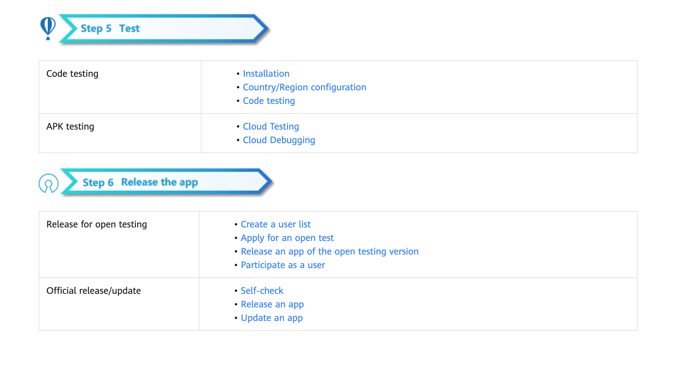

# 推送业务 (HMS)

## 业务介绍

华为推送服务（Push Kit）是华为为您提供的消息推送平台，建立了从云端到终端的消息推送通道。您通过集成推送服务可以实时推送消息到用户终端，构筑良好的用户关系，提升用户的感知度和活跃度。

### 使用场景

| <div style="width:80px">场景分类</div> | 场景说明                                                     |
| -------------------------------------- | ------------------------------------------------------------ |
| 社交场景                               | 用户在带有社交属性的应用中产生点赞、评论、分享等社交行为时，应用会调用推送服务，对目标用户进行消息提醒，用户不打开应用也能收到提醒，从而促进用户多次互动，形成功能闭环，提升用户活跃度。 |
| 营销活动                               | 游戏类、电商类、工具类等应用经常需要产品推广和营销活动，应用通过调用服务端API，精准筛选标签，圈选目标营销受众，进行定向消息推送，以更主动的方式触达更多用户，吸引用户消费，从而提升最终营销活动转化效果。 |
| 系统通知                               | 工具类或具有系统通知类需求的应用，通常在用户或系统功能状态变化时，需要对用户进行及时告知。应用可通过调用服务端API直接将消息推送给目标设备，促使用户完成特定操作。 |
| 用户促活                               | 产品通常需要针对生命周期中不同阶段的用户进行分层促活运营，如对新用户推送产品引导等。通过对新用户进行精准定位，判断用户在实际操作中可能遇到的问题或用户最可能感兴趣的活动等，定向主动地进行消息推送，提升留存，最终实现活跃用户数的增长。 |
| 新闻资讯                               | 资讯、视频类应用通常需要对突发新闻热点进行抢先报道，并且完成用户的快速触达，从而帮助用户快速获得最新、关注度最高的资讯内容。应用可以对设有特定标签的用户进行消息通知，在最短时效内触达更多用户，从而提升推送内容的阅读量和用户粘性。 |

## Unity项目集成设置

### 注册认证

在开始之前，首先您需要创建华为开发者账号，项目，以及App。请参考[华为HMS文档](https://developer.huawei.com/consumer/cn/doc/development/HMS-Guides/Preparations) 


我们默认您已经创建并拥有了华为HMS项目，以及对应的App信息

### 创建应用

在您的Unity项目中完成以下构建环境的设置，以便使用华为HMS SDK构建安卓 APK。


进入 **Editor -> Build Settings -> Platform -> Andriod**， 点击 **Switch Platform** 切换到安卓平台。


进入 **Player Settings -> Publishing Settings**，勾选以下环境配置项目。


### 开发准备

按照[华为HMS 集成开发指南介绍](https://developer.huawei.com/consumer/cn/codelab/HMSPreparation/index.html#6)，我们仍需要对这些Gradle文件做进一步开发准备的设置。


您可以根据[华为HMS Core集成准备](https://developer.huawei.com/consumer/cn/codelab/HMSPreparation/index.html#6)对自己对文件进行配置。您也可以从我们的[示例项目](https://github.com/Unity-Technologies/HMSSDKSample/tree/master/Assets/Plugins/Android)中的具体参数设置，进行参考与对比，完成以下一系列的开发准备配置。

1. 启用并对 `AndroidManifest.xml` 做以下配置

   进入 **Edit -> Project Settings -> Player -> Android(icon) -> Publishing Settings -> Build**，启用 **Custom Main Manifest**

   当使用“推送服务” 和“定位服务” 的时候，我们需要启用 **AndroidManifest** 

   如果您的Unity版本低于**2019.2（含）**，上述设置界面中并没有 **AndroidManifest** 选项，但您可以将`AndroidManifest.xml`文件手动放置到`Assets/Plugins/Android` 路径下。

   ```
    <?xml version="1.0" encoding="utf-8"?>
       <!-- GENERATED BY UNITY. REMOVE THIS COMMENT TO PREVENT OVERWRITING WHEN EXPORTING AGAIN-->
       <manifest
           xmlns:android="http://schemas.android.com/apk/res/android"
           package="com.unity3d.player"
           xmlns:tools="http://schemas.android.com/tools">
           <uses-permission android:name="android.permission.ACCESS_COARSE_LOCATION"/>
           <uses-permission android:name="android.permission.ACCESS_FINE_LOCATION"/>
           <uses-permission android:name="android.permission.ACCESS_BACKGROUND_LOCATION" />
           <uses-permission android:name="com.huawei.hms.permission.ACTIVITY_RECOGNITION" />
           <uses-permission android:name="android.permission.ACTIVITY_RECOGNITION" />
           <uses-permission android:name="android.permission.ACCESS_MOCK_LOCATION" />
           <application>
               <activity android:name="com.hms.hms_analytic_activity.HmsAnalyticActivity"
                       android:theme="@style/UnityThemeSelector">
                   <intent-filter>
                       <action android:name="android.intent.action.MAIN" />
                       <category android:name="android.intent.category.LAUNCHER" />
                   </intent-filter>
                   <meta-data android:name="unityplayer.UnityActivity" android:value="true" />
               </activity>
               <service
                   android:name="com.unity.hms.push.MyPushService"
                   android:exported="false">
                   <intent-filter>
                       <action android:name="com.huawei.push.action.MESSAGING_EVENT"/>
                   </intent-filter>
               </service>
               <receiver
                       android:name="com.unity.hms.location.LocationBroadcastReceiver"
                       android:exported="true">
                   <intent-filter>
                       <action android:name="com.huawei.hmssample.location.LocationBroadcastReceiver.ACTION_PROCESS_LOCATION" />
                   </intent-filter>
               </receiver>
               <receiver
                       android:name="com.unity.hms.location.GeoFenceBroadcastReceiver"
                       android:exported="true">
                   <intent-filter>
                       <action android:name="com.huawei.hmssample.geofence.GeoFenceBroadcastReceiver.ACTION_PROCESS_LOCATION" />
                   </intent-filter>
               </receiver>
           </application>
       </manifest>
   ```


2. 启用并对project gradle文件添加配置

   进入 **Edit -> Project Settings -> Player -> Android(icon) -> Publishing Settings -> Build** ，启用 **Custom Base Gradle Template** 并在文件中添加 AppGallery Connect plugin 和 Maven repository。路径是`Assets/Plugins/Android/baseProjectTemplate.gradle`。

   如果您的Unity版本低于**2019.2（含）**，则需要在 <code>MainGradleTemplate.gradle</code> 中添加配置。

   ```
       allprojects {
           buildscript {
               repositories {**ARTIFACTORYREPOSITORY**
                   google()
                   jcenter()
                   maven { url 'https://developer.huawei.com/repo/' }
               }
   
               dependencies {
                   // If you are changing the Android Gradle Plugin version, make sure it is compatible with the Gradle version preinstalled with Unity
                   // See which Gradle version is preinstalled with Unity here https://docs.unity3d.com/Manual/android-gradle-overview.html
                   // See official Gradle and Android Gradle Plugin compatibility table here https://developer.android.com/studio/releases/gradle-plugin#updating-gradle
                   // To specify a custom Gradle version in Unity, go do "Preferences > External Tools", uncheck "Gradle Installed with Unity (recommended)" and specify a path to a custom Gradle version
                   classpath 'com.android.tools.build:gradle:3.4.0'
                   classpath 'com.huawei.agconnect:agcp:1.2.1.301'
                   **BUILD_SCRIPT_DEPS**
               }
           }
   
           repositories {**ARTIFACTORYREPOSITORY**
               google()
               jcenter()
               flatDir {
                   dirs "${project(':unityLibrary').projectDir}/libs"
               }
               maven { url 'https://developer.huawei.com/repo/' }
           }
       }
   
       task clean(type: Delete) {
           delete rootProject.buildDir
       }
   ```
   
3. 启用并对app gradle文件添加配置

   进入 **Edit -> Project Settings -> Player -> Android(icon) -> Publishing Settings -> Build**，启用 **Custom Launcher Gradle Template** 并在 `launcherTemplate.gradle` 中添加依赖。路径为 `Assets/Plugins/Android/LauncherTemplate.gradle`。

    如果您的Unity版本低于**2019.2（含）**， 则需要在 <code>MainGradleTemplate.gradle</code>中添加配置。
   
   ```
       dependencies {
           implementation project(':unityLibrary')
           implementation 'com.huawei.hms:ads-lite:13.4.29.303'
           implementation 'com.huawei.hms:ads-consent:3.4.30.301'
           implementation 'com.huawei.hms:push:4.0.3.301'
           implementation 'com.huawei.hms:hianalytics:5.1.0.300'
           implementation 'com.android.support:appcompat-v7:28.0.0'
           implementation 'com.huawei.hms:hianalytics:5.0.0.301'
           implementation 'com.huawei.agconnect:agconnect-core:1.2.0.300'
           implementation 'com.huawei.hms:base:4.0.1.300'
           implementation 'com.huawei.hms:hwid:4.0.1.300'
           implementation 'com.huawei.hms:game:4.0.1.300'
           }
   ```

4. 使用并对unity library gradle文件进行以下设置

    进入 **Edit -> Project Settings -> Player -> Android(icon) -> Publishing Settings -> Build**，启用 **Custom Main Gradle Template** 并在 `mainTemplate.gradle` 中添加依赖。路径为 `Assets/Plugins/Android/mainTemplate.gradle.gradle`。
    
    如果您的Unity版本低于**2019.2（含）**， 则需要在 <code>MainGradleTemplate.gradle</code>中添加配置。
    
    ```
        dependencies {
            implementation fileTree(dir: 'libs', include: ['*.jar'])
            implementation 'com.huawei.hms:hianalytics:5.0.0.301'
            implementation 'com.huawei.agconnect:agconnect-core:1.2.0.300'
            implementation 'com.huawei.hms:base:4.0.1.300'
            implementation 'com.huawei.hms:hwid:4.0.1.300'
            implementation 'com.huawei.hms:game:4.0.1.300'
        **DEPS**}
    ```
5. 创建Signature

   进入 **Edit -> Project Settings -> Player -> Android(icon) -> Publishing Settings -> Keystore Manager**， 点击 **Keytore... -> create new**

   

   您需要在打开unity时设定并输入密码，否则将无法构建。无需在 gradle 中添加signature。

6. 签署证书指纹

   参照华为[HMS Core集成准备 Step4](https://developer.huawei.com/consumer/cn/codelab/HMSPreparation/index.html#3) 生成SHA256证书指纹

   

   参照华为[HMS Core集成准备 Step5](https://developer.huawei.com/consumer/cn/codelab/HMSPreparation/index.html#4)在AppGAllery Connect里添加指纹。

   

7. 设置package name，及其他设置

   进入 **Edit -> Project Settings -> Player**设置package name。

   package name格式为 `com.${Company Name}.${Product Name}`

   同时也可以在此步骤完成其余的所需设置，比如您的应用版本号、应用的图标、设置显示的分辨率等。

   

8. `Agconnect-services.json`

   我们还需要从华为开发者账号内下载这个json文件，加入所需信息后，放到 `Assets/Plugins/Android` 路径下。

   从华为开发者账号内下载此json 文件并在其中加以下信息。同样的，您可以在我们的[示例项目文件](https://github.com/Unity-Technologies/HMSSDKSample/blob/master/Assets/Plugins/Android/agconnect-services.json)中直接参考！

   ```
   "agcgw":{
   "backurl":"connect-drcn.dbankcloud.cn",
   "url":"connect-drcn.hispace.hicloud.com"
   },
   ```

   当我们使用“分析服务”、“推送服务”、或“定位服务”时，必须配置 `agconnect-services.json` 文件。

   参考 [链接](https://developer.huawei.com/consumer/cn/doc/development/HMSCore-Guides/android-config-agc-0000001050170137) 以创建`agconnect-services.json`

   

9. 获取activity

   可以用 `Common.GetActivity()`函数来获取activity。

## SDK集成开发
### SDK开发

HMS 套件中共包括4个功能服务，在[示例项目](https://github.com/Unity-Technologies/HMSSDKSample)中都有相应的示例场景。 为了进行测试，您需要通过HMS将其构建到Android移动版上。 确保已创建HMS帐户和项目。 然后，您就可以更改配置并测试不同的功能。


在示例项目中，推送服务对应的场景是： `Assets/HuaweiServiceDemo/Scenes/HmsPushSampleScene.unity` 而对应的代码是： `Assets/HuaweiServiceDemo/demo/test/PushTest.cs`.

我们需要设置的服务
1. 实现 `IPushServiceListener`接口

2. 通过 `PushListenerRegister.RegisterListener`方法得到 Receiver

3. 将下列代码添加到`AndroidManifest.xml`

   ```
   <application>
       ...
       <service
           android:name="com.unity.hms.push.MyPushService"
           android:exported="false">
           <intent-filter>
               <action android:name="com.huawei.push.action.MESSAGING_EVENT"/>
           </intent-filter>
       </service>
       ...
   </application>
   ```

   `android:name` 是固定的。


### 测试与发布
参考华为 [HMS Core集成流程](https://developer.huawei.com/consumer/cn/doc/start/hitHMSCore) for testing and releasing.





