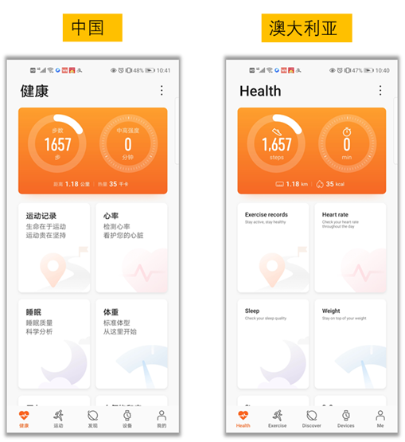
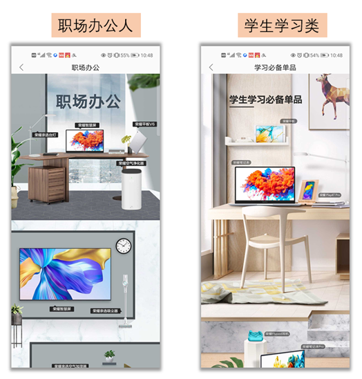
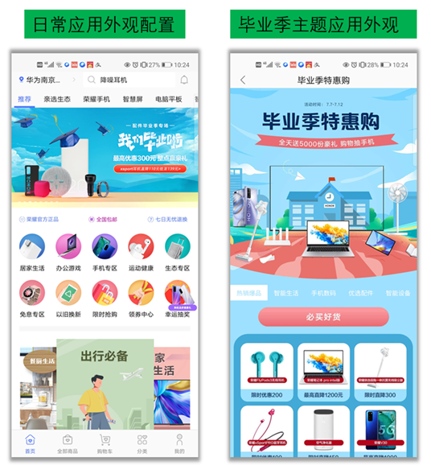

# 远程配置(AGC)


## 业务介绍

华为AppGallery Connect提供了[远程配置](https://developer.huawei.com/consumer/cn/doc/development/AppGallery-connect-Guides/agc-remoteconfig-introduction)服务，可以在线管理参数。 使用该服务，您可以在线更改应用程序的行为和外观，而无需用户更新应用程序。

通过集成客户端SDK，您的应用程序可以定期获取控制台上传递的参数值，以修改应用程序的行为和外观。


### 主要功能

*   参数管理：包括添加，删除和修改参数，将现有参数复制和修改为新参数，以及设置条件值。

*   条件管理：包括添加，删除和修改条件，以及将现有条件复制和修改为新条件。目前，您可以设置这些条件：版本，语言，国家/地区，受众，用户属性，用户百分比和时间。未来将有更多可用的条件。

*   版本管理：支持对300个历史版本的参数和条件进行多达90天的管理和回滚。

*   权限管理：默认情况下，允许帐户所有者，管理员，应用程序管理员，研发人员和操作人员访问远程配置。


### 典型应用场景

#### 不同地区展现不同语言

使用远程配置的时间条件，设定特定时间触发内容。使用远程配置的国家地区条件和设备语言条件，设定在不同的国家地区分配不同的参数值，从而呈现不同的促销内容。如下图在中国和澳大利亚2个地区，呈现不同的语言。



#### 不同用户展现不同内容

协同高级分析服务，针对不同的用户受众群组推荐不同内容：根据华为分析服务定义的不同用户受众群体，比如对职场白领和学生推送不同的物品及页面布局。



#### 特定主题特定时间配置

更改应用的颜色以配合特定的主题:使用远程配置的时间条件，设定应用不同的颜色、图片素材，配合经常变化的特定主题。比如下图中毕业季这个特殊的时间段，配置一些相关的内容以吸引用户购买。



#### 功能发布

在同一时刻面向所有用户发布新功能的风险很高，利用远程配置可以实现按照百分比发布，从而缓慢向用户发布新功能，可以有效避免舆情或者及时修改调整。


## 华为账号设置

1. 在AppGallery Connect中创建一个应用程序，然后将AppGallery Connect SDK集成到您的应用程序中。有关详细信息，请参阅[AppGallery Connect开发服务使用入门](https://developer.huawei.com/consumer/cn/doc/development/AppGallery-connect-Guides/agc-get-started)。

2. 在项目列表中找到您的项目，然后在项目卡上单击要启用应用程序链接的应用程序。

   


3. 转到 **增长 > 远程配置**。在远程配置页面上，单击 **立即启用** 。

   **注意：**
   启用远程配置时，您可能需要设置数据存储位置。然后，`agconnect-services.json`中的设置将相应地自动更新。如果在启用远程配置时设置了数据存储位置，则需要再次下载`agconnect-services.json`文件，并在启用该服务后将其集成到您的项目中。有关详细信息，请参阅[添加配置文件](https://developer.huawei.com/consumer/cn/doc/development/AppGallery-connect-Guides/agc-get-started#addjson)。

4. 配置json文件

   将`agconnect-services.json` 文件复制到`Assets/Plugins/Android`文件夹中。

   

## Unity项目设置

### 集成远程配置SDK

1. 启用并对project gradle文件添加配置

   进入 **Edit -> Project Settings -> Player -> Android(icon) -> Publishing Settings -> Build**

   启用 **Custom Base Gradle Template** 并在文件中添加 AppGallery Connect plugin 和 Maven repository。路径是`Assets/Plugins/Android/baseProjectTemplate.gradle`。

   如果您的Unity版本低于**2019.2（含）**，则需要在 <code>MainGradleTemplate.gradle</code> 中添加配置。
   
   ```
       allprojects {
           buildscript {
               repositories {
   ...
                   maven { url 'https://developer.huawei.com/repo/' }
   ...
               }
   ...
           }
   ...
           repositories {
   ...
               maven { url 'https://developer.huawei.com/repo/' }
   ...
           }
       }
   ```
   
2. 启用并对app gradle文件添加配置

   进入 **Edit -> Project Settings -> Player -> Android(icon) -> Publishing Settings -> Build**，启用 **Custom Launcher Gradle Template** 并在 `launcherTemplate.gradle` 中添加依赖。路径为 `Assets/Plugins/Android/LauncherTemplate.gradle`。

    如果您的Unity版本低于**2019.2（含）**， 则需要在 <code>MainGradleTemplate.gradle</code>中添加配置。
   
   ```
     dependencies {
   …
      implementation 'com.huawei.agconnect:agconnect-remoteconfig:1.6.1.300'
   ...
   }
   ```

3. 可选：使用XML资源文件

   由于Unity无法将xml资源用作Android，因此请将xml资源放在`/Assets/HuaweiService/Android/res/xml/`下。

   例如`/Assets/HuaweiService/Android/res/xml/remote_config.xml`。
   
   ```
   <?xml version="1.0" encoding="utf-8"?>
   <remote-config>
       <value key="test1">test1</value>
       <value key="test2">true</value>
       <value key="test3">111</value>
       <value key="test4">123.456</value>
       <value key="test5">FromXml</value>
   </remote-config>
   ```
   
   使用帮助功能获取配置ID，并应用xml数据，例如：
   
   ```
   public void SetXmlValue()
   {
       var config = AGConnectConfig.getInstance();
       int configId = AndroidUtil.GetId(new Context(), "xml", "remote_config");
       config.applyDefault(configId);
       showAllValues();
   }
   ```
   
4. 在  **Edit -> Project Settings -> Player ->  Android(icon) -> other settings -> Identification -> Package Name** 中设置Package name。

   Package Name即为华为项目中应用程序的Package Name。
   
   

## SDK集成开发


### 示例: Apply xml 配置

设置场景

1. 新建一个场景

    

2. 右键单击并选择UI，然后选择button:

    

3. 将Component添加到button并开发脚本：

    
    
    

4. 编辑脚本:

    
    
    双击脚本文件，然后您将在VS code中打开它
    
    

5. 定义接口

    ```
    using HuaweiService;
    
    public class 
    {
    
        public void SetXmlValue()
        {
            var config = AGConnectConfig.getInstance();
            // get res id
            int configId = AndroidUtil.GetId(new Context(), "xml", "remote_config");
            config.applyDefault(configId);
            // get variable
            Map map = config.getMergedAll();
            var keySet = map.keySet();
            var keyArray = keySet.toArray();
            foreach (var key in keyArray)
            {
                var value = config.getSource(key);
                // Use the key and value ...
            }
        }
    
    }
    ```
    
    创建函数

6. 绑定脚本中的按钮和界面

   

   - 步骤1：点击“ +”添加功能
   
   - 步骤2：选择具有您要使用的界面的对应场景
   
   - 步骤3：单击“No Function”以选择脚本，然后选择相应的函数

        

### 演示项目

如果仍有不清楚的地方，可以查看github上的demo，对应的远程配置用法是：[RemoteConfigTest.cs](https://github.com/Unity-Technologies/HuaweiServiceSample/blob/8a72eb9b34a2d6f1cfe3a8d3340dbf2c6ae1eb4b/Assets/HuaweiServiceDemo/Scripts/test/RemoteConfigTest.cs ) 