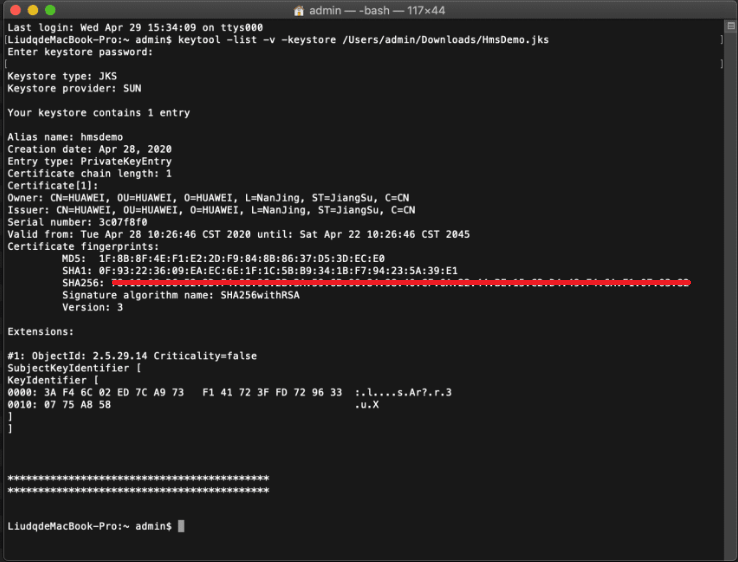
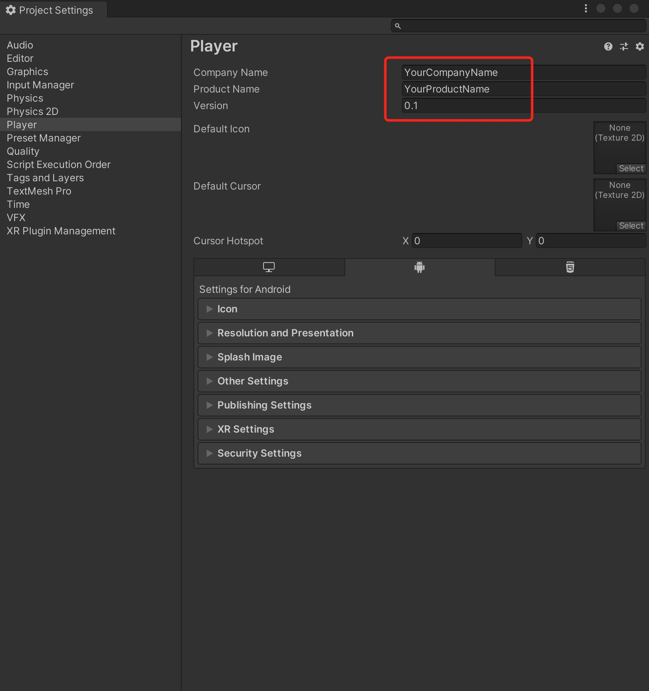

# Location Kit (HMS)

## Service Introduction

Location Kit combines the Global Navigation Satellite System (GNSS), Wi-Fi, and base station location functionalities into your app to build up global positioning capabilities, allowing you to provide flexible location-based services for global users. Currently, it provides three main capabilities: fused location, activity identification, and geofence. You can call one or more of these capabilities as needed. 

- Fused location: Provides a set of easy-to-use APIs for your app to quickly obtain the device location based on the GNSS, Wi-Fi, and base station location data.

- Activity identification: Identifies user activity status through the acceleration sensor, cellular network information, and magnetometer, helping you adapt your app to user behavior.

- Geofence: Allows you to set an interested area through an API so that your app can receive a notification when a specified action (such as leaving, entering, or staying in the area) occurs.

### Use Cases

#### Fused Location

If your app needs to obtain the device location, you need to apply for the location permission for your app, call the [requestLocationUpdates](https://developer.huawei.com/consumer/en/doc/development/HMSCore-References-V5/fusedlocationproviderclient-0000001050746169-V5#EN-US_TOPIC_0000001050746169__section1210118391289) method of Location Kit, set request parameters in [LocationRequest](https://developer.huawei.com/consumer/en/doc/development/HMSCore-References-V5/locationrequest-0000001050986189-V5), and specify a location mode as needed. To stop obtaining location information, call the [removeLocationUpdates](https://developer.huawei.com/consumer/en/doc/development/HMSCore-References-V5/fusedlocationproviderclient-0000001050746169-V5#EN-US_TOPIC_0000001050746169__section14923192365816) method. 

**NOTE:**<br>The fused location function uses the WGS-84 coordinate system for the returned locations.

#### Activity Identification

Your app can obtain the activity status (such as walking, running, or cycling) of a device in either of the following methods: 

- Method 1: Call the [createActivityIdentificationUpdates](https://developer.huawei.com/consumer/en/doc/development/HMSCore-References-V5/activityidentificationservice-0000001050986183-V5#EN-US_TOPIC_0000001050986183__section177364246397) method to proactively obtain the current device activity status. In this method, you can set the interval (in milliseconds) for detecting activity identification updates. Larger values will result in fewer activity detections, and smaller values will result in more activity detections. To stop requesting activity identification updates, call the [deleteActivityIdentificationUpdates](https://developer.huawei.com/consumer/en/doc/development/HMSCore-References-V5/activityidentificationservice-0000001050986183-V5#EN-US_TOPIC_0000001050986183__section18411141614334) method.

- Method 2: Call the [createActivityConversionUpdates](https://developer.huawei.com/consumer/en/doc/development/HMSCore-References-V5/activityidentificationservice-0000001050986183-V5#EN-US_TOPIC_0000001050986183__section461610311343) method to detect activity conversion updates of the current device. The interval for detecting activity conversion updates is 5 seconds when the screen is on and 200 seconds when the screen is off. You can select an activity status for detection. For details about all activity statuses, please refer to [Constant-values](https://developer.huawei.com/consumer/en/doc/development/HMSCore-References-V5/constant-values-0000001050746179-V5#EN-US_TOPIC_0000001050746179__section1569121418414). To stop requesting activity conversion updates, call the [deleteActivityConversionUpdates](https://developer.huawei.com/consumer/en/doc/development/HMSCore-References-V5/activityidentificationservice-0000001050986183-V5#EN-US_TOPIC_0000001050986183__section17434718321)method.

#### Geofence

You can call the [createGeofenceList](https://developer.huawei.com/consumer/en/doc/development/HMSCore-References-V5/geofenceservice-0000001050986187-V5#EN-US_TOPIC_0000001050986187__section9254532817) method to create a geofence based on the location that is of interest. Then, Location Kit can sense the distance between the current device location and the geofence. When the device enters the geofence, a notification will be sent to your app. In addition, Location Kit can detect the duration during which the device stays in the geofence, and send a notification to your app if the stay duration reaches your preset limit.

You can also create a geofence by dragging to select an area on the map and setting relevant parameters. For details, please refer to [Server Development](https://developer.huawei.com/consumer/en/doc/development/HMSCore-Guides-V5/server-dev-0000001050170474-V5).

## Integrating into Your Unity Project

### Register and get verified

Before doing this step, you need to create an HMS Account, project and App according to [the HMS document](https://developer.huawei.com/consumer/en/doc/development/HMS-Guides/Preparations).


Now you have your Huawei HMS Project and App information.

### Create an app

Create Unity project, and you will also need to set up the build environment for building Android apk with HMS SDK. Then, finish the following preparation.


In **Editor -> Build Settings**, Switch platform to Andriod and Connect your Android device


In **Player Settings -> Publishing Settings**, enable the following environment checkboxes


### Prepare for development

According to [HMS integration process introduction](https://developer.huawei.com/consumer/en/codelab/HMSPreparation/index.html#6), we still need to add some configurations to the gradle files for development preparations.


You can follow [Huawei documentation guidance](https://developer.huawei.com/consumer/en/codelab/HMSPreparation/index.html#6) to do the configuration, you can also refer and compare with the files in our [Unity example project](https://github.com/Unity-Technologies/HMSSDKSample/tree/master/Assets/Plugins/Android).

1. Enable and add configurations to `AndroidManifest.xml`

   Go to **Edit -> Project Settings -> Player -> Android(icon) -> Publishing Settings -> Build**

   Enable **Custom Main Manifest**

   We should enable **AndroidManifest** when we use push or location sdk.

   If Unity Version is **2019.2 or before**, there is no **AndroidManifest** checkbox, but you can put `AndroidManifest.xml` under `Assets/Plugins/Android`.

   ```
       <?xml version="1.0" encoding="utf-8"?>
       <!-- GENERATED BY UNITY. REMOVE THIS COMMENT TO PREVENT OVERWRITING WHEN EXPORTING AGAIN-->
       <manifest
           xmlns:android="http://schemas.android.com/apk/res/android"
           package="com.unity3d.player"
           xmlns:tools="http://schemas.android.com/tools">
           <uses-permission android:name="android.permission.ACCESS_COARSE_LOCATION"/>
           <uses-permission android:name="android.permission.ACCESS_FINE_LOCATION"/>
           <uses-permission android:name="android.permission.ACCESS_BACKGROUND_LOCATION" />
           <uses-permission android:name="com.huawei.hms.permission.ACTIVITY_RECOGNITION" />
           <uses-permission android:name="android.permission.ACTIVITY_RECOGNITION" />
           <uses-permission android:name="android.permission.ACCESS_MOCK_LOCATION" />
           <application>
               <activity android:name="com.hms.hms_analytic_activity.HmsAnalyticActivity"
                       android:theme="@style/UnityThemeSelector">
                   <intent-filter>
                       <action android:name="android.intent.action.MAIN" />
                       <category android:name="android.intent.category.LAUNCHER" />
                   </intent-filter>
                   <meta-data android:name="unityplayer.UnityActivity" android:value="true" />
               </activity>
               <service
                   android:name="com.unity.hms.push.MyPushService"
                   android:exported="false">
                   <intent-filter>
                       <action android:name="com.huawei.push.action.MESSAGING_EVENT"/>
                   </intent-filter>
               </service>
               <receiver
                       android:name="com.unity.hms.location.LocationBroadcastReceiver"
                       android:exported="true">
                   <intent-filter>
                       <action android:name="com.huawei.hmssample.location.LocationBroadcastReceiver.ACTION_PROCESS_LOCATION" />
                   </intent-filter>
               </receiver>
               <receiver
                       android:name="com.unity.hms.location.GeoFenceBroadcastReceiver"
                       android:exported="true">
                   <intent-filter>
                       <action android:name="com.huawei.hmssample.geofence.GeoFenceBroadcastReceiver.ACTION_PROCESS_LOCATION" />
                   </intent-filter>
               </receiver>
           </application>
       </manifest>
   ```

2. Enable and add configurations to project gradle

   Go to **Edit -> Project Settings -> Player -> Android(icon) -> Publishing Settings -> Build**

   Enable **Custom Base Gradle Template** and add the AppGallery Connect plugin and the Maven repository. The path is `Assets/Plugins/Android/baseProjectTemplate.gradle`.

   If your unity version is **2019.2 or before**, you should add implement and other configuration on `MainGradleTemplate.gradle`.

   ```
       // GENERATED BY UNITY. REMOVE THIS COMMENT TO PREVENT OVERWRITING WHEN EXPORTING AGAIN
   
       allprojects {
           buildscript {
               repositories {**ARTIFACTORYREPOSITORY**
                   google()
                   jcenter()
                   maven { url 'https://developer.huawei.com/repo/' }
               }
   
               dependencies {
                   // If you are changing the Android Gradle Plugin version, make sure it is compatible with the Gradle version preinstalled with Unity
                   // See which Gradle version is preinstalled with Unity here https://docs.unity3d.com/Manual/android-gradle-overview.html
                   // See official Gradle and Android Gradle Plugin compatibility table here https://developer.android.com/studio/releases/gradle-plugin#updating-gradle
                   // To specify a custom Gradle version in Unity, go do "Preferences > External Tools", uncheck "Gradle Installed with Unity (recommended)" and specify a path to a custom Gradle version
                   classpath 'com.android.tools.build:gradle:3.4.0'
                   classpath 'com.huawei.agconnect:agcp:1.2.1.301'
                   **BUILD_SCRIPT_DEPS**
               }
           }
   
           repositories {**ARTIFACTORYREPOSITORY**
               google()
               jcenter()
               flatDir {
                   dirs "${project(':unityLibrary').projectDir}/libs"
               }
               maven { url 'https://developer.huawei.com/repo/' }
           }
       }
   
       task clean(type: Delete) {
           delete rootProject.buildDir
       }
   ```

3. Enable and add configurations to app gradle

   Go to **Edit -> Project Settings -> Player -> Android(icon) -> Publishing Settings -> Build**

   Enable **Custom Launcher Gradle Template** and add build dependencies in `launcherTemplate.gradle`. The path is `Assets/Plugins/Android/launcherTmeplate.gradle`.

   If unity version is **2019.2 or before**, you should add implement and other configuration on `MainGradleTemplate`.

   ```
       dependencies {
           implementation project(':unityLibrary')
           implementation 'com.huawei.hms:location:5.0.0.302'
           implementation 'com.android.support:appcompat-v7:28.0.0'
           implementation 'com.huawei.hms:base:6.2.0.300'
           implementation 'com.huawei.hms:hwid:6.1.0.303'
           }
   ```
   
4. Enable and add configurations to unity library gradle

   Go to **Edit -> Project Settings -> Player -> Android(icon) -> Publishing Settings -> Build**

   Enable **Custom Main Gradle Template** and add build dependencies. The path is `Assets/Plugins/Android/mainTemplate.gradle`.

   If unity version is **2019.2 or before**, you should add implement and other configuration on `MainGradleTemplate.gradle`.

   ```
   dependencies {
       implementation fileTree(dir: 'libs', include: ['*.jar'])
       implementation 'com.huawei.hms:hianalytics:5.0.0.301'
       implementation 'com.huawei.agconnect:agconnect-core:1.6.1.300'
       implementation 'com.huawei.hms:base:6.2.0.300'
       implementation 'com.huawei.hms:hwid:6.1.0.303'
       implementation 'com.huawei.hms:game:6.1.0.301'
   **DEPS**}
   ```

5. Signature

   Go to **Edit -> Project Settings -> Player -> Android(icon) -> Publishing Settings -> Keystore Manager**

   Click **Keytore... -> create new**

   

   You need to enter the password when you open unity, otherwise you cannot build. There's no need to add a signature on gradle.

6. Signing Certificate Fingerprint

   Please refer to Huawei [preparation documentation step 4](https://developer.huawei.com/consumer/en/codelab/HMSPreparation/index.html#3) for generating a SHA256 Certificate Fingerprint.

   

   And refer to Huawei [preparation documentation step 5](https://developer.huawei.com/consumer/en/codelab/HMSPreparation/index.html#4) to add Fingerprint to AppGallery Connect.

   

7. Package name

   Set the package name in **Edit -> Project Settings -> Player**

   The package name is `com.${Company Name}.${Product Name}`.

   You can also complete the rest of the settings here, such as version number, icons, resolution, etc. 

   

8. `agconnect-services.json`

   We should put the json file under `Assets/Plugins/Android`.

   Add this following message into the json file downloaded from your Huawei developer dashboard. Also, you can [refer to that file](https://github.com/Unity-Technologies/HMSSDKSample/blob/master/Assets/Plugins/Android/agconnect-services.json) in our Unity example project.

   ```
   "agcgw":{
   "backurl":"connect-drcn.dbankcloud.cn",
   "url":"connect-drcn.hispace.hicloud.com"
   },
   ```

   You can refer to [this link](https://developer.huawei.com/consumer/en/doc/development/HMSCore-Guides/android-config-agc-0000001050170137) to create `agconnect-services.json`.

   

9. Configuring Obfuscation Scripts

    Before building the APK, configure the obfuscation configuration file to prevent the HMS Core SDK from being obfuscated.（[Reference](https://developer.huawei.com/consumer/en/doc/development/HMSCore-Guides/config-obfuscation-scripts-0000001188775555)）
    - Open the proguard file in your Unity project and add configurations to exclude the HMS Core SDK from obfuscation.
    ```
    -ignorewarnings
    -keepattributes *Annotation*
    -keepattributes Exceptions
    -keepattributes InnerClasses
    -keepattributes Signature
    -keepattributes SourceFile,LineNumberTable
    -keep class com.huawei.hianalytics.**{*;}
    -keep class com.huawei.updatesdk.**{*;}
    -keep class com.huawei.hms.**{*;}
    -keep class * extends com.huawei.location.router.LocationApiRequest{ *; }
    -keep class * extends com.huawei.hms.core.aidl.IMessageEntity{ *; }
    -keep public class com.huawei.location.nlp.network.** {*; }
    -keep class com.huawei.wisesecurity.ucs.**{*;}
    ```
    - (Optional) Configure the keep.xml file as follows to keep layout resources if you have enabled R8 resource shrinking (with shrinkResources being set to true in the project-level build.gradle file) and strict reference checks (with shrinkMode being set to strict in the res/raw/keep.xml file). Not keeping layout resources will lead to app rejection during release to HUAWEI AppGallery.
    ```
    <?xml version="1.0" encoding="utf-8"?>
    <resources xmlns:tools="http://schemas.android.com/tools"
        tools:keep="@layout/hms_download_progress,@drawable/screen_off"
        tools:shrinkMode="strict" />
    ```

10. Get activity

   For getting the activity, you can use the  `Common.GetActivity()` function.

## Developing with the SDK

### Developing

There are corresponding example scenes in the [example project](https://github.com/Unity-Technologies/HMSSDKSample) for all 4 Kits. For testing, you will need to build it onto Android mobile build by HMS. Make sure you have already created your HMS account and project. Then, you can change the configuration and test different functions.


We need to add implentment `com.android.support:appcompat-v7:28.0.0` to **launcherTemplate**.

In the example project, the corresponding scene for Location Kit is  `Assets/HuaweiServiceDemo/Scenes/HmsLocationSampleScene.unity` and the code is `Assets/HuaweiServiceDemo/Scripts/test/location/LocationTest.cs`.

We need to set receiver.

- **LocationBroadcastReceiver**

   1. Implement interface `IBroadcastReceiver`

   2. Get Receiver by method `BroadcastRegister.CreateLocationReceiver`

   3. Add the following code to `AndroidManifest.xml`

      ```
      <application>
          ...
          <receiver
                  android:name="com.unity.hms.location.LocationBroadcastReceiver"
                  android:exported="true">
              <intent-filter>
                  <action android:name=`${Your action name}` />
              </intent-filter>
          </receiver>
          ...
      </application>
      ```

      `android:name` is fixed.

      You can set the value of `action android:name`. But the value should be the same as the parameter of `intent.setAction`.

- **GeoFenceReceiver**

   1. Implement interface `IBroadcastReceiver`

   2. Get Receiver by method `BroadcastRegister.CreateGeoFenceReceiver`

   3. Add the following code to `AndroidManifest.xml`

      ```
      <application>
          ...
          <receiver
                  android:name="com.unity.hms.location.GeoFenceBroadcastReceiver"
                  android:exported="true">
              <intent-filter>
                  <action android:name=`${Your action name}` />
              </intent-filter>
          </receiver>
          ...
      </application>
      ```

      `android:name` is fixed.

      You can set the value of `action android:name`. But the value should be the same as the parameter of `intent.setAction`.

### Test & Release

Please refer to Huawei [integration procedure](https://developer.huawei.com/consumer/en/doc/start/htiHMSCore) for testing and releasing.


